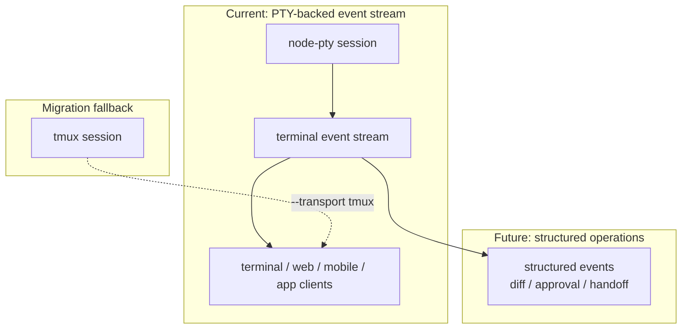
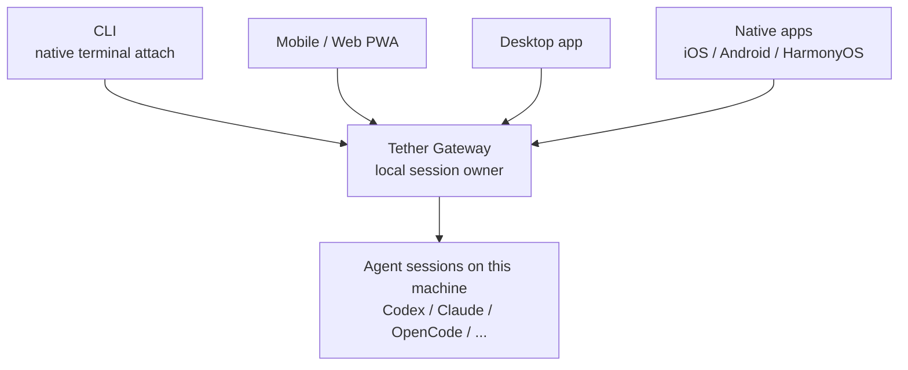
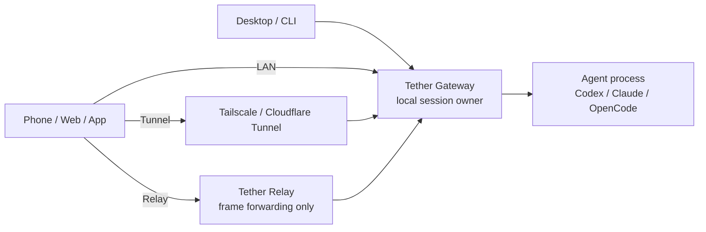
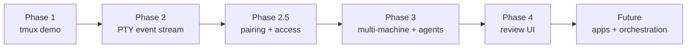

# Tether

[中文 README](./README.zh-CN.md)

> **The OS layer for AI agents.**
>
> Run Codex, Claude, OpenCode, and the next wave of agent CLIs on your own
> machine — and take over from any device.
> Persistent. Observable. Approvable. Orchestratable.

**Current status**: PTY-backed event stream is now the default transport.
`tether codex`, `tether claude`, and `tether opencode` run inside a
Gateway-owned PTY session with append-only events, WebSocket attach, Web
xterm rendering, and a tmux fallback for migration.

The chat window is the wrong abstraction.

AI agents are no longer one-shot Q&A. They run for hours, edit code, run tests,
hit external services, and wait. Managing that with a chat box that loses
context the moment you switch IDEs is like managing a production cluster
through PuTTY.

Tether is not a better IDE, and not a prettier chat UI.
Tether builds the layer underneath: **agent operations** — process model,
session protocol, device trust, cross-surface takeover, and orchestration for
agents.

```text
Before: codex
After:  tether codex

Before: claude
After:  tether claude
```

Run `tether codex` or `tether claude` on your computer. Tether wraps the agent
into a managed session and prints a URL. Open it on your phone and you are
looking at the same live work — every keystroke from the desktop appears, every
character you type on the phone reaches the agent. Code keeps executing on your
machine. Credentials never leave it.

## The Bet

The next developer workflow is not "one human at one editor."

It is one human supervising ten agents across laptops, workstations, CI,
phones, and scheduled jobs — running them the way an SRE runs a fleet of
services.

Whoever owns that control plane owns the entry point of the next generation of
developer tools.

Tether has been built around that bet from day one:

- agents are background processes, not chat sessions
- the Gateway owns sessions; arbitrary shell access is never on the table
- any screen can become an attach point for the same work
- execution stays local; supervision goes anywhere
- event streams, approvals, handoffs, and verification loops are first-class —
  not patched on later

## Built For

- **Any screen is a workstation**: desktop app, mobile app, web, and CLI are
  all first-class — none of them is a second seat.
- **Local execution is non-negotiable**: agents run on your machine, your repo,
  your credentials, your toolchain. The cloud cannot reproduce them and does
  not need to.
- **One Gateway for every agent**: Codex, Claude, OpenCode, and whichever CLI
  ships next — same session protocol behind them all.
- **Heavy lifting on the workstation, supervision in your pocket**: build
  machines do the work; laptops and phones watch, intervene, and approve.
- **Hand it off and walk away**: dispatch the task, close the lid, get a push
  when something needs you, glance at the diff, decide, continue.
- **Critical actions go through you**: writes, commands, external calls — diff
  and intent surface for review before they execute.
- **Multi-agent collaboration is real, not a slide**: handoff, verification
  loops, and agent teams are first-class in the protocol — not a prompt
  wrapper.
- **Privacy by architecture, not by promise**: the relay forwards frames;
  execution authority and session plaintext never leave the local Gateway.

## What Already Runs

Working today:

- `tether codex` / `tether claude` — wrap an agent into a managed session in
  one command
- Local Gateway / daemon on `127.0.0.1:4789`
- Gateway-owned `node-pty` sessions with append-only `session_events`
- Native terminal attach, Web xterm attach, and mobile-web/PWA-ready layout
- WebSocket live stream by default, explicit HTTP fallback when needed
- Control / observe attach modes and active-controller resize ownership
- Attached client registry, stop endpoint, session lost detection
- SQLite session and event registry
- tmux fallback through `--transport tmux` for migration only
- pnpm workspace skeleton: CLI, Gateway, protocol, config, UI, web, and native
  client packages all in place

The old tmux capture/send layer is no longer the default path. It remains as a
fallback while the PTY event-stream path hardens.



## Quick Start

Requirements:

- Node.js 20+
- pnpm
- Codex CLI or Claude CLI installed locally

```bash
pnpm install
pnpm tether --help
pnpm tether codex
pnpm tether claude
```

By default, the Gateway only listens on localhost:

```text
127.0.0.1:4789
```

For a trusted LAN demo, explicitly expose it:

```bash
pnpm tether codex --host 0.0.0.0
pnpm tether claude --host 0.0.0.0
```

LAN mode currently has one-time WebSocket tickets but does not yet have full
device-token pairing. Use it only on a trusted network.

Useful commands:

```bash
pnpm tether gateway
pnpm tether run codex --no-attach
pnpm tether attach <session-id> --control
pnpm tether attach <session-id> --observe
pnpm tether clients <session-id>
pnpm tether stop <session-id>
pnpm tether stop --all
pnpm tether codex --transport tmux   # migration fallback
```

Current local limitation: multiple `run --no-attach` sessions are supported,
but each PTY session is still owned by the CLI/Gateway process that created it.
Until the full Gateway supervisor lands, run concurrent detached sessions on
separate ports, or keep the creating process alive.

## Surfaces

Tether is not a web dashboard. **The Gateway is the product** — every UI is
just an attach point. New surfaces can be added or replaced; sessions and
execution authority always live in the Gateway.

Current and planned surfaces:

- CLI (native terminal attach)
- Desktop web / mobile web PWA
- Desktop app (macOS / Windows / Linux)
- iOS / Android / HarmonyOS native apps
- Flutter cross-platform clients
- Floating desktop console (watch without blocking your screen)
- Automation entry point / agent-to-agent control API



## Product Direction

Three access paths — same Gateway, from your home Wi-Fi to a flight halfway
around the world:



- **LAN**: phone and computer on the same network, direct to the Gateway.
  Zero middlemen.
- **Tunnel**: expose the Gateway through the Tailscale or Cloudflare Tunnel
  you already trust, with device-token auth on top.
- **Relay**: Gateway opens an outbound WSS to a relay; the relay forwards
  bytes — it never executes commands and never holds plaintext.

Control plane principles — local first, cloud later:

- Pairing starts locally: `tether pair`, `tether devices`, `tether revoke`.
  Works without any account system.
- The cloud handles routing, push, device directory, and remote revoke — never
  control.
- Session plaintext does not leave your machine by default.
- The phone can request a whitelist of local actions: open a desktop web UI,
  attach an existing session, send input to the agent. That is the entire menu.
- The phone **cannot** ask the Gateway to execute arbitrary shell commands.
  This is a hard architectural boundary, not a feature toggle.

## Roadmap



| Phase | Theme | Key shift |
| --- | --- | --- |
| Phase 1 | Demo | tmux proved the desktop / phone shared-session loop |
| Phase 2 | Event stream | PTY-backed event stream becomes the default transport |
| Phase 2.5 | Access | pairing, device tokens, three-tier LAN / tunnel / relay entry |
| Phase 3 | Scale out | multi-machine, parallel agents, background tasks, push |
| Phase 4 | Review UI | diffs, file tree, approval surfaces, permission review |
| Future | Apps | desktop app, mobile native apps, Flutter clients, floating console |
| Future | Orchestration | agent handoff, verification loops, agent teams, scheduled work |

**Phase 2 is the watershed.** Tether is moving from "shared sessions" into an
agent operations platform: event streams turn approvals, multi-agent
coordination, app clients, and relay sync from duct-taped extensions into
natural extensions.

## Why Another Agent Console?

Most agent consoles solve a shallow problem: how to poke the same agent from
more clients.

Tether solves the deeper one underneath: who owns this session, which machine
is it running on, who has the right to interrupt it, how does it cooperate
with other agents, and where does the audit trail live when things break.

That is not a remote-control problem. It is an **agent operations** problem —
the next generation of DevOps, where the things you operate are no longer
services, but agents.

## What Tether Is Not

Drawing the boundaries clearly so nobody shows up with the wrong map.

- **Not an IDE**, and never trying to replace VS Code or Cursor. How you write
  code is not Tether's business.
- **Not a code editor.** No syntax tree, no completions.
- **Not a generic remote shell.** The Gateway will not accept arbitrary
  command execution. This is a design hard line.
- **Not `codex_manager`**: that project reads existing Codex JSONL files for
  post-hoc observability. Tether wraps live agent processes so they can be
  controlled from anywhere.
- **Not a paseo clone**: there is overlap on the event-stream direction, but
  Tether's center of gravity is local Gateway ownership, multi-machine
  supervision, app-grade clients, and treating agents as background tasks.
  This is infrastructure, not a UI.

## Safety Model

Tether holds the keys to terminal processes on your machine. The security
boundary is part of the product, not a compliance checklist tacked on before
release.

- **Strict by default**: the Gateway binds only to `127.0.0.1`. It does not
  listen on any external interface unless you say so.
- **Exposure must be explicit**: sharing on the LAN requires `--host 0.0.0.0`
  by hand. Nothing leaks because of a stray default.
- **Writes require credentials**: from Phase 2.5 onward, every client write
  action requires a device token.
- **Clients can send input, never get a shell**: phone and web clients can
  message an existing agent session — they cannot gain arbitrary command
  execution.
- **Secrets do not belong on screen**: terminal output forwarded to clients
  is masked for common tokens and credentials.
- **Relay only moves bytes**: command execution always happens on the local
  Gateway. The relay does not — and structurally cannot — execute anything.

## Repository Layout

```text
apps/cli        tether command entry
apps/gateway    local Gateway, PTY event stream, and tmux fallback
apps/web        React/Vite web client for session viewing
apps/admin-web  React/Vite admin console
apps/server     auth and management API
apps/relay      relay service
packages/core   core types and business model
packages/protocol
                Gateway / client / relay protocol contracts
packages/config default config
packages/design shared UI primitives
packages/theme  shared theme tokens and global styles
native/         Flutter / HarmonyOS client placeholders
```

Web development:

```bash
pnpm dev:web
pnpm build:web
```

Gateway serves `apps/web/dist` at runtime. If the web app has not been built,
`/remote/session/:id` will ask you to run `pnpm build:web`.

## Development

```bash
pnpm install
pnpm typecheck
pnpm tether --help
```

Package manager: pnpm.

Runtime: Node.js 20+.

TypeScript is run directly through `tsx`; the Web client is built with Vite and
served by the Gateway from `apps/web/dist`.

## License

Apache-2.0, see [LICENSE](./LICENSE).

## Star History

[](https://www.star-history.com/#dream2672/tether&Date)
