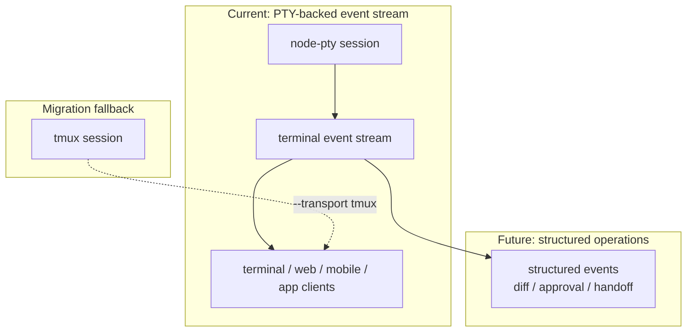
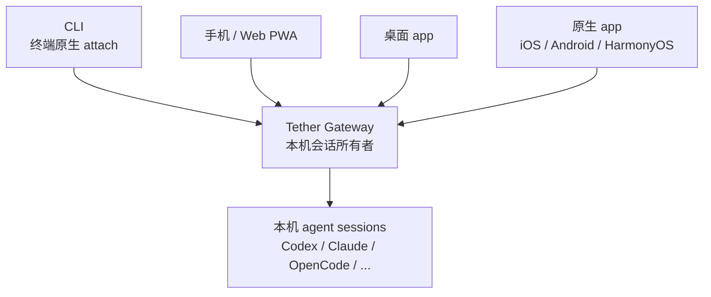
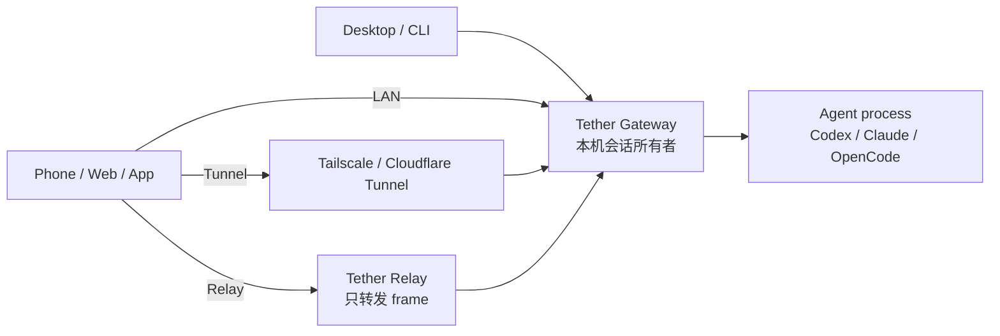
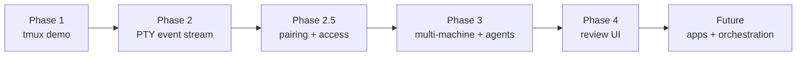

# Tether

[English README](./README.md)

> **AI agent 的操作系统层。**
>
> Codex、Claude、OpenCode 和下一批 agent CLI，在你自己的机器上跑，从任何设备接管。
> 持久、可观察、可审批、可编排。

**当前状态**：PTY-backed event stream 已经是默认传输层。
`tether codex`、`tether claude`、`tether opencode` 会跑在 Gateway 托管的
PTY 会话里，输出进入 append-only 事件流，WebSocket 实时 attach，Web 端用
xterm 渲染；tmux 只保留为迁移期 fallback。

聊天窗口是错的抽象。

AI agent 已经不是一次性问答，而是一个会跑几小时、改代码、跑测试、调外部服务的长期工作进程。再用一个开关 IDE 就丢上下文的聊天框去管它，相当于用 PuTTY 管一整个生产集群。

Tether 不做更好的 IDE，也不做更漂亮的聊天 UI。
Tether 做下一层：**agent operations**——agent 的进程模型、会话协议、设备信任、跨端接管和编排。

```text
以前：codex
现在：tether codex

以前：claude
现在：tether claude
```

电脑上敲 `tether codex` 或 `tether claude`，Tether 接管这条 agent，打印一个 URL。手机扫开，就是同一个会话现场——电脑里在跑什么，手机上一字不落；手机上敲一行字，agent 立刻收到。代码继续在你机器上执行，凭证从不离开本地。

## 判断

下一个开发工作流不是"一个人坐在一个编辑器前"。

是一个人同时盯着十条 agent，分布在笔记本、工作站、CI、手机、定时任务里，像 SRE 盯一组服务那样运维它们。

谁掌握了那一层控制面，谁就拿到了下一代开发者工具的入口。

Tether 从第一天就按这个判断在做：

- agent 是后台进程，不是聊天会话
- Gateway 持有会话，不暴露任意 shell
- 任何屏幕都能成为同一份工作的接入面
- 执行留在本机，监督可以远程
- 事件流、审批、handoff、验证 loop 是一等公民，不是事后补丁

## 为谁而造

- **任何屏幕都是工位**：桌面 app、手机 app、Web、CLI 全是一等入口，不分主从。
- **本机执行不可让渡**：agent 跑在你的机器、你的仓库、你的凭证、你的工具链上，云端拿不到也复刻不了。
- **一个 Gateway 管所有 agent**：Codex、Claude、OpenCode、以及还没出生的下一个 CLI，挂在同一条会话协议后面。
- **重活跑工作站，监督在口袋里**：编译机/远端机器负责出力，笔记本和手机只负责盯、接管、放行。
- **派出去就能离开**：交代完任务关上电脑，结果出来时手机推送，回来一眼看清做了什么、要不要继续。
- **关键动作必须经过你**：写文件、跑命令、调外部服务，diff 和意图先送到你眼前再执行。
- **多 agent 协作不是 PPT**：handoff、验证 loop、agent 团队是协议里的一等公民，不是包一层 prompt 就算数。
- **隐私不靠承诺，靠架构**：relay 只搬 frame，执行权和会话明文从来不出本机。

## 现在跑得起来的部分

已经能跑：

- `tether codex` / `tether claude`：一行命令把 agent 包进托管会话
- 本机 Gateway / daemon 监听 `127.0.0.1:4789`
- Gateway-owned `node-pty` 会话和 append-only `session_events`
- 电脑端终端 attach、Web xterm attach、手机 Web / PWA 适配布局
- 默认 WebSocket 实时流，必要时可显式切到 HTTP fallback
- control / observe 两种 attach 模式，活跃 controller 拥有 resize 权
- attached client registry、stop endpoint、session lost 检测
- SQLite session 和 event registry
- `--transport tmux` 迁移期 fallback
- pnpm workspace 骨架：CLI、Gateway、protocol、config、UI、Web、native client 全部就位

旧的 tmux capture/send 已经不是默认主路径，只作为 fallback 留着，方便迁移和对照。



## 快速开始

### 安装

依赖：Node.js >= 22.13，macOS（Linux 实验性支持）

```bash
npm install -g @tether-labs/cli
```

### 使用

```bash
# （一次性）选择默认模式，写入 ~/.tether/config.json
# 模式说明：
#   local  — 仅本机，无需账号
#   direct — 局域网访问，需要 tether 账号
#   relay  — 任意网络远程访问，需要 tether 账号
tether gateway init

# 以系统服务方式启动后台 Gateway（首次运行自动安装 LaunchAgent）
tether gateway start

# 或在前台运行（适合调试）
tether gateway

# 启动 agent session
tether codex
tether claude

# 常用参数：
#   --project <path>   工作目录（默认：当前目录）
#   --title <title>    session 标题，显示在 Web UI 中
#   --no-attach        只启动 session，不接入当前终端
#   --no-reconnect     本地 attach 断开后不自动重连
#   [providerArgs...]  透传给底层 CLI 的额外参数

# 示例：
tether codex --title "修复 auth bug" --project ~/myrepo
tether codex --no-attach                   # 后台运行，稍后 attach
tether codex -- --model o3                 # 透传参数给 codex 本身

# 查看所有 session
tether ls

# attach 到正在运行的 session
tether attach <session-id>

# 停止 session
tether stop <session-id>
```

默认情况下，Gateway 只监听本机：

```text
127.0.0.1:4789
```

如果要做可信局域网 demo，需要显式开放：

```bash
tether codex --host 0.0.0.0
tether claude --host 0.0.0.0
```

局域网模式当前已有一次性 WebSocket ticket，但完整 device-token pairing 还没落地。
只建议在可信网络里使用。

### 诊断

```bash
tether doctor          # 检查运行环境
tether gateway status  # 查看 Gateway 状态
```

### 开发者模式

```bash
pnpm install
pnpm tether --help
pnpm tether codex
```

## 接入面

Tether 不是 Web dashboard。**Gateway 才是产品**，所有 UI 都只是接入面——可以再加，也可以替换，但会话和执行权一直在 Gateway 这一层。

当前与规划中的接入面：

- CLI（终端原生 attach）
- 桌面 Web / 手机 Web PWA
- 桌面 app（macOS / Windows / Linux）
- iOS / Android / HarmonyOS 原生 app
- Flutter 多端客户端
- 桌面浮窗控制台（盯着的同时不挡视线）
- 自动化入口 / agent-to-agent 控制 API



## 产品方向

三种接入路径，覆盖从家里 LAN 到跨国出差：



- **LAN**：手机和电脑同一个网，直连 Gateway，零中间环节。
- **Tunnel**：用你已经在用的 Tailscale 或 Cloudflare Tunnel 暴露 Gateway，叠加 device token 认证。
- **Relay**：Gateway 主动开一条 outbound WSS 到中继；中继只转发字节，不执行命令、不持有明文。

控制权的设计原则——本地优先，云端后置：

- 配对从本地开始：`tether pair`、`tether devices`、`tether revoke`，不经过任何账户系统也能用。
- 云账户只做路由、push、设备目录和远程吊销；它从来不是控制中心。
- 会话明文默认不上云。
- 手机能请求的本机动作是白名单制的：打开桌面 Web UI、attach 既有 session、把消息送给 agent——仅此而已。
- 手机**永远不能**让 Gateway 执行任意 shell 命令。这是设计上的硬边界，不是功能取舍。

## 路线图



| 阶段 | 主题 | 关键变化 |
| --- | --- | --- |
| Phase 1 | Demo | tmux 跑通"电脑/手机共享同一条 agent" |
| Phase 2 | Event stream | PTY-backed event stream 成为默认传输层 |
| Phase 2.5 | Access | 配对、device token、LAN / tunnel / relay 三档接入 |
| Phase 3 | Scale out | 多机器、多 agent 并行、后台任务、push 通知 |
| Phase 4 | Review UI | diff、文件树、审批面板、权限审阅工作流 |
| Future | Apps | 桌面 app、手机原生 app、Flutter 客户端、桌面浮窗 |
| Future | Orchestration | agent handoff、验证 loop、agent team、定时任务 |

**Phase 2 是分水岭。** Tether 正在从"会话共享"进入 agent operations 平台：
事件流让审批、多 agent 协同、app 客户端、relay 同步从拼凑变成顺理成章。

## 为什么还需要一个 Agent Console？

市面上的 agent console 大多在解一个浅问题：怎么从更多客户端去戳同一个 agent。

Tether 解的是更底层那个：谁拥有这个会话、它在哪台机器上跑、谁有权打断它、它和其他 agent 怎么协作、出问题时审计链在哪里。

这不是"远程控制工具"的问题域，是 **agent operations** 的问题域——下一代的 DevOps，对象不是服务，是 agent。

## Tether 不是什么

边界划清楚，省得拿错地图找路。

- **不是 IDE**，也不打算替代 VS Code 或 Cursor。你怎么写代码不归 Tether 管。
- **不是代码编辑器**。Tether 不渲染语法树，不做补全。
- **不是通用远程 shell**。Gateway 不接受任意命令执行，这是设计死线。
- **不是 `codex_manager`**：后者读取已存在的 Codex JSONL 做事后观察；Tether 包的是活的 agent 进程，让它跨端可控。
- **不是 paseo 复刻**：事件流方向上有交集，但 Tether 的重心是本机 Gateway ownership、多机器调度、app 级客户端、agent 后台任务化——是基础设施，不是 UI。

## 安全模型

Tether 握着你机器上的终端进程——安全边界是产品本身的一部分，不是发布前补的合规清单。

- **默认就是最严**：Gateway 只绑 `127.0.0.1`，不主动监听任何外网接口。
- **暴露必须显式**：要在局域网共享，必须自己加 `--host 0.0.0.0`，不会因为开关位置巧合而泄露。
- **写操作要凭证**：Phase 2.5 起，客户端任何写操作都需要 device token。
- **客户端能发输入，不能拿 shell**：手机/Web 只能向既有 agent session 发消息，无法获得任意命令执行能力。
- **secrets 不该出屏幕**：传到客户端的终端输出会对常见 token / 密钥做掩码。
- **Relay 只搬字节**：命令执行永远在本机 Gateway 上发生，relay 没有也不会有这个权限。

## 仓库结构

```text
apps/cli        tether 命令入口
apps/gateway    本地 Gateway、PTY event stream 和 tmux fallback
apps/web        用于查看 session 的 React/Vite Web 客户端
apps/admin-web  React/Vite 管理控制台
apps/server     认证和管理 API
apps/relay      relay 服务
packages/core   核心类型和业务模型
packages/protocol
                Gateway / client / relay 协议契约
packages/config 默认配置
packages/design 共享 UI 基础组件
packages/theme  共享主题 token 和全局样式
native/         Flutter / HarmonyOS 客户端预留
```

Web 开发：

```bash
pnpm web:dev
pnpm web:build
```

Gateway 运行时托管 `apps/web/dist`。如果还没有构建 Web app，`/remote/session/:id` 会提示先运行 `pnpm web:build`。

## 开发

```bash
pnpm install
pnpm typecheck
pnpm tether --help
```

包管理器：pnpm。

运行时：Node.js 20+。

TypeScript 通过 `tsx` 直接运行；Web 客户端由 Vite 构建，并由 Gateway 从
`apps/web/dist` 托管。

## 部署（管理后台）

### 架构

```
用户浏览器
    ↓
Nginx :80 / :443
    ├── /admin/*       → 静态文件（admin-web dist）
    ├── /admin/api/*   → proxy → Node :4800
    ├── /api/*         → proxy → Node :4800
    ├── /gateway       → proxy → WebSocket :4889
    └── /client        → proxy → WebSocket :4889
```

### Nginx 配置（`tether.earntools.me` 示例）

```nginx
server {
    listen 80;
    server_name tether.earntools.me;

    root /data/tether/apps/web/dist;
    index index.html;

    # Admin API（比 /admin 更长，优先匹配）
    location /admin/api/ {
        proxy_pass http://127.0.0.1:4800;
        proxy_http_version 1.1;
        proxy_set_header Host $host;
        proxy_set_header X-Real-IP $remote_addr;
        proxy_set_header X-Forwarded-For $proxy_add_x_forwarded_for;
    }

    # 后端 API（用户认证 / admin 登录注册等）
    location /api/ {
        proxy_pass http://127.0.0.1:4800;
        proxy_http_version 1.1;
        proxy_set_header Host $host;
        proxy_set_header X-Real-IP $remote_addr;
        proxy_set_header X-Forwarded-For $proxy_add_x_forwarded_for;
    }

    # Admin Web 静态文件（SPA 兜底）
    location /admin {
        alias /data/tether/apps/admin-web/dist;
        try_files $uri $uri/ /admin/index.html;
    }

    # Gateway WebSocket
    location /gateway {
        proxy_pass http://127.0.0.1:4889/gateway;
        proxy_http_version 1.1;
        proxy_set_header Upgrade $http_upgrade;
        proxy_set_header Connection "upgrade";
        proxy_set_header Host $host;
        proxy_read_timeout 3600s;
        proxy_send_timeout 3600s;
    }

    location /client {
        proxy_pass http://127.0.0.1:4889/client;
        proxy_http_version 1.1;
        proxy_set_header Upgrade $http_upgrade;
        proxy_set_header Connection "upgrade";
        proxy_set_header Host $host;
        proxy_read_timeout 3600s;
        proxy_send_timeout 3600s;
    }

    location / {
        try_files $uri $uri/ /index.html;
    }
}
```

### 部署步骤

```bash
# 1. 拉代码
cd /data/tether && git pull

# 2. 安装依赖
pnpm install

# 3. 构建
pnpm build:admin    # → apps/admin-web/dist/
pnpm build:server   # → apps/server/dist/

# 4. 更新 nginx 并重载
nginx -t && nginx -s reload

# 5. 设置生产环境变量
export EGG_SERVER_ENV=prod
export TETHER_SERVER_JWT_SECRET=<强随机密钥>
export TETHER_SERVER_WEB_ORIGIN=https://tether.earntools.me
export TETHER_SERVER_HOST=127.0.0.1
export TETHER_SERVER_PORT=4800

# 6. 启动 server
cd apps/server && pnpm start
```

### 环境变量说明

| 变量 | 必填 | 说明 |
|------|------|------|
| `TETHER_SERVER_JWT_SECRET` | ✅ | 生产环境必须设置，否则启动失败 |
| `TETHER_SERVER_WEB_ORIGIN` | ✅ | 前端域名，用于 CORS 白名单 |
| `EGG_SERVER_ENV` | ✅ | 设为 `prod`，不加载 `config.local.ts` |
| `TETHER_SERVER_HOST` | — | 默认 `127.0.0.1` |
| `TETHER_SERVER_PORT` | — | 默认 `4800` |

访问 `https://tether.earntools.me/admin` 即为管理后台。

## License

Apache-2.0，见 [LICENSE](./LICENSE)。

## Star History

[](https://www.star-history.com/#dream2672/tether&Date)
