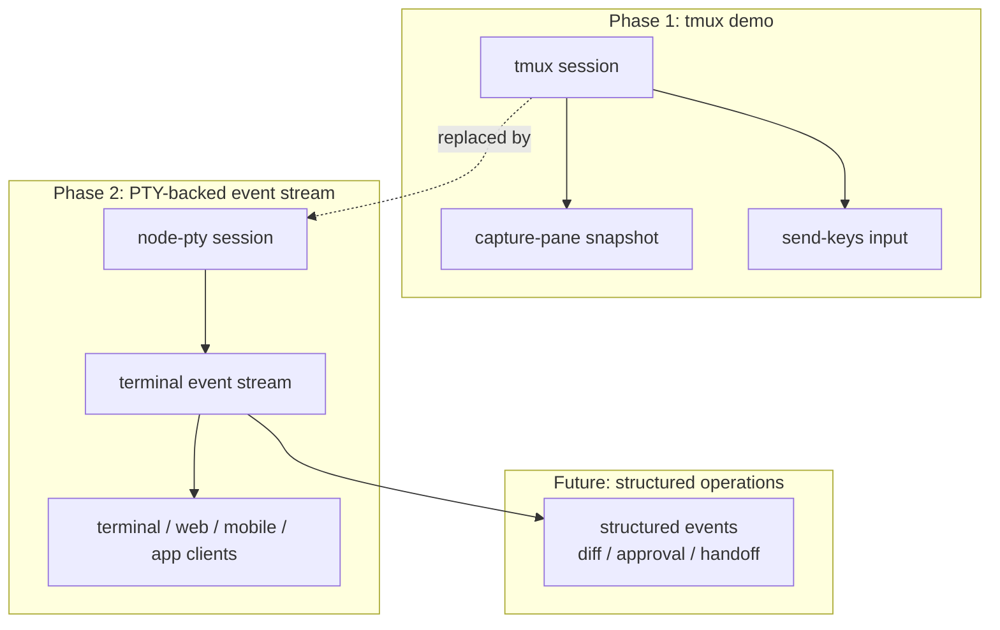
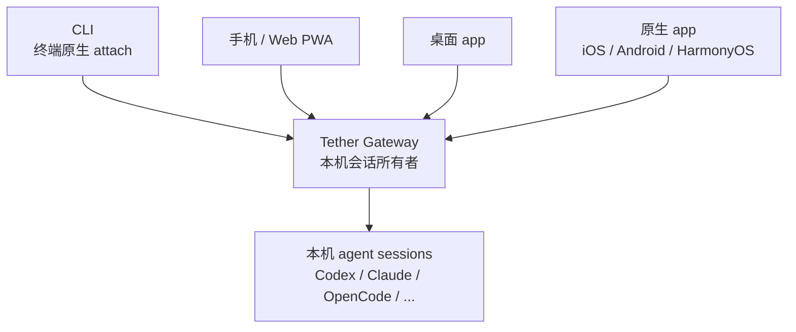
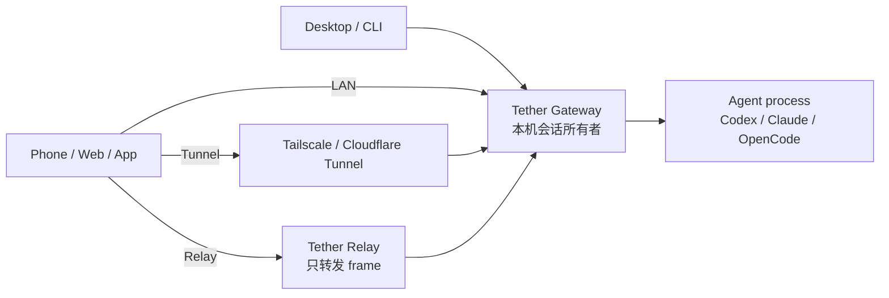
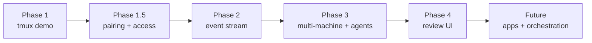

# Tether

[English README](./README.md)

> **AI agent 的操作系统层。**
>
> Codex、Claude、OpenCode 和下一批 agent CLI，在你自己的机器上跑，从任何设备接管。
> 持久、可观察、可审批、可编排。

**当前状态**：Phase 1 demo 骨架已跑通端到端闭环。

聊天窗口是错的抽象。

AI agent 已经不是一次性问答，而是一个会跑几小时、改代码、跑测试、调外部服务的长期工作进程。再用一个开关 IDE 就丢上下文的聊天框去管它，相当于用 PuTTY 管一整个生产集群。

Tether 不做更好的 IDE，也不做更漂亮的聊天 UI。
Tether 做下一层：**agent operations**——agent 的进程模型、会话协议、设备信任、跨端接管和编排。

```text
以前：codex
现在：tether codex

以前：claude
现在：tether claude
```

电脑上敲 `tether codex` 或 `tether claude`，Tether 接管这条 agent，打印一个 URL。手机扫开，就是同一个会话现场——电脑里在跑什么，手机上一字不落；手机上敲一行字，agent 立刻收到。代码继续在你机器上执行，凭证从不离开本地。

## 判断

下一个开发工作流不是"一个人坐在一个编辑器前"。

是一个人同时盯着十条 agent，分布在笔记本、工作站、CI、手机、定时任务里，像 SRE 盯一组服务那样运维它们。

谁掌握了那一层控制面，谁就拿到了下一代开发者工具的入口。

Tether 从第一天就按这个判断在做：

- agent 是后台进程，不是聊天会话
- Gateway 持有会话，不暴露任意 shell
- 任何屏幕都能成为同一份工作的接入面
- 执行留在本机，监督可以远程
- 事件流、审批、handoff、验证 loop 是一等公民，不是事后补丁

## 为谁而造

- **任何屏幕都是工位**：桌面 app、手机 app、Web、CLI 全是一等入口，不分主从。
- **本机执行不可让渡**：agent 跑在你的机器、你的仓库、你的凭证、你的工具链上，云端拿不到也复刻不了。
- **一个 Gateway 管所有 agent**：Codex、Claude、OpenCode、以及还没出生的下一个 CLI，挂在同一条会话协议后面。
- **重活跑工作站，监督在口袋里**：编译机/远端机器负责出力，笔记本和手机只负责盯、接管、放行。
- **派出去就能离开**：交代完任务关上电脑，结果出来时手机推送，回来一眼看清做了什么、要不要继续。
- **关键动作必须经过你**：写文件、跑命令、调外部服务，diff 和意图先送到你眼前再执行。
- **多 agent 协作不是 PPT**：handoff、验证 loop、agent 团队是协议里的一等公民，不是包一层 prompt 就算数。
- **隐私不靠承诺，靠架构**：relay 只搬 frame，执行权和会话明文从来不出本机。

## 现在跑得起来的部分

Phase 1 故意做得很薄。要先证明"同一个 agent 会话能在电脑和手机之间无缝接管"这条主线跑得通，再去做事件流和重型架构。空头支票不算数。

已经能跑：

- `tether codex` / `tether claude`：一行命令把 agent 包进托管会话
- 本机 Gateway / daemon 监听 `127.0.0.1:4789`
- tmux-backed 会话适配（demo 阶段，会被替换）
- 电脑端终端 attach，手机 / Web 端会话视图
- 手机输入实时转发给既有 agent 进程
- 轮询式 snapshot API（Phase 2 会换成事件流）
- SQLite session registry
- pnpm workspace 骨架：CLI、Gateway、protocol、config、UI、Web、native client 全部就位

会留下来的：Gateway、CLI 形态、API 边界、包结构。
会被换掉的：tmux capture/send 这层临时实现。Phase 1 是 demo，但底座是认真的。



## 快速开始

依赖：

- Node.js 20+
- pnpm
- tmux
- 本机已安装 Codex CLI 或 Claude CLI

```bash
brew install tmux
pnpm install
pnpm tether --help
pnpm tether codex
pnpm tether claude
```

默认情况下，Gateway 只监听本机：

```text
127.0.0.1:4789
```

如果要做可信局域网 demo，需要显式开放：

```bash
pnpm tether codex --host 0.0.0.0
pnpm tether claude --host 0.0.0.0
```

Phase 1 的局域网模式还没有启用设备认证，只适合可信网络。

## 接入面

Tether 不是 Web dashboard。**Gateway 才是产品**，所有 UI 都只是接入面——可以再加，也可以替换，但会话和执行权一直在 Gateway 这一层。

当前与规划中的接入面：

- CLI（终端原生 attach）
- 桌面 Web / 手机 Web PWA
- 桌面 app（macOS / Windows / Linux）
- iOS / Android / HarmonyOS 原生 app
- Flutter 多端客户端
- 桌面浮窗控制台（盯着的同时不挡视线）
- 自动化入口 / agent-to-agent 控制 API



## 产品方向

三种接入路径，覆盖从家里 LAN 到跨国出差：



- **LAN**：手机和电脑同一个网，直连 Gateway，零中间环节。
- **Tunnel**：用你已经在用的 Tailscale 或 Cloudflare Tunnel 暴露 Gateway，叠加 device token 认证。
- **Relay**：Gateway 主动开一条 outbound WSS 到中继；中继只转发字节，不执行命令、不持有明文。

控制权的设计原则——本地优先，云端后置：

- 配对从本地开始：`tether pair`、`tether devices`、`tether revoke`，不经过任何账户系统也能用。
- 云账户只做路由、push、设备目录和远程吊销；它从来不是控制中心。
- 会话明文默认不上云。
- 手机能请求的本机动作是白名单制的：打开桌面 Web UI、attach 既有 session、把消息送给 agent——仅此而已。
- 手机**永远不能**让 Gateway 执行任意 shell 命令。这是设计上的硬边界，不是功能取舍。

## 路线图



| 阶段 | 主题 | 关键变化 |
| --- | --- | --- |
| Phase 1 | Demo | tmux 跑通"电脑/手机共享同一条 agent" |
| Phase 1.5 | Access | 配对、device token、LAN / tunnel / relay 三档接入 |
| Phase 2 | Event stream | 抛弃 snapshot 轮询，全面切到原生 session 事件 |
| Phase 3 | Scale out | 多机器、多 agent 并行、后台任务、push 通知 |
| Phase 4 | Review UI | diff、文件树、审批面板、权限审阅工作流 |
| Future | Apps | 桌面 app、手机原生 app、Flutter 客户端、桌面浮窗 |
| Future | Orchestration | agent handoff、验证 loop、agent team、定时任务 |

**Phase 2 是分水岭。** 在那之前 Tether 是"会话共享"；在那之后 Tether 才真正成为 agent operations 平台——事件流让审批、多 agent 协同、app 客户端、relay 同步从拼凑变成顺理成章。

## 为什么还需要一个 Agent Console？

市面上的 agent console 大多在解一个浅问题：怎么从更多客户端去戳同一个 agent。

Tether 解的是更底层那个：谁拥有这个会话、它在哪台机器上跑、谁有权打断它、它和其他 agent 怎么协作、出问题时审计链在哪里。

这不是"远程控制工具"的问题域，是 **agent operations** 的问题域——下一代的 DevOps，对象不是服务，是 agent。

## Tether 不是什么

边界划清楚，省得拿错地图找路。

- **不是 IDE**，也不打算替代 VS Code 或 Cursor。你怎么写代码不归 Tether 管。
- **不是代码编辑器**。Tether 不渲染语法树，不做补全。
- **不是通用远程 shell**。Gateway 不接受任意命令执行，这是设计死线。
- **不是 `codex_manager`**：后者读取已存在的 Codex JSONL 做事后观察；Tether 包的是活的 agent 进程，让它跨端可控。
- **不是 paseo 复刻**：事件流方向上有交集，但 Tether 的重心是本机 Gateway ownership、多机器调度、app 级客户端、agent 后台任务化——是基础设施，不是 UI。

## 安全模型

Tether 握着你机器上的终端进程——安全边界是产品本身的一部分，不是发布前补的合规清单。

- **默认就是最严**：Gateway 只绑 `127.0.0.1`，不主动监听任何外网接口。
- **暴露必须显式**：要在局域网共享，必须自己加 `--host 0.0.0.0`，不会因为开关位置巧合而泄露。
- **写操作要凭证**：Phase 1.5 起，客户端任何写操作都需要 device token。
- **客户端能发输入，不能拿 shell**：手机/Web 只能向既有 agent session 发消息，无法获得任意命令执行能力。
- **secrets 不该出屏幕**：传到客户端的终端输出会对常见 token / 密钥做掩码。
- **Relay 只搬字节**：命令执行永远在本机 Gateway 上发生，relay 没有也不会有这个权限。

## 仓库结构

```text
apps/cli        tether 命令入口
apps/gateway    本地 Gateway / daemon 和 Phase 1 tmux adapter
apps/web        用于查看 session 的 React/Vite Web 客户端
packages/core   核心类型和业务模型
packages/protocol
                Gateway / client / relay 协议契约
packages/config 默认配置
packages/ui     共享 UI 包预留
native/         Flutter / HarmonyOS 客户端预留
```

Web 开发：

```bash
pnpm web:dev
pnpm web:build
```

Gateway 运行时托管 `apps/web/dist`。如果还没有构建 Web app，`/remote/session/:id` 会提示先运行 `pnpm web:build`。

## 开发

```bash
pnpm install
pnpm typecheck
pnpm tether --help
```

包管理器：pnpm。

运行时：Node.js 20+。

TypeScript 通过 `tsx` 直接运行；Phase 1 不需要打包 server build。

## License

Apache-2.0，见 [LICENSE](./LICENSE)。

## Star History

[](https://www.star-history.com/#dream2672/tether&Date)
