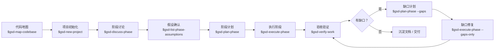
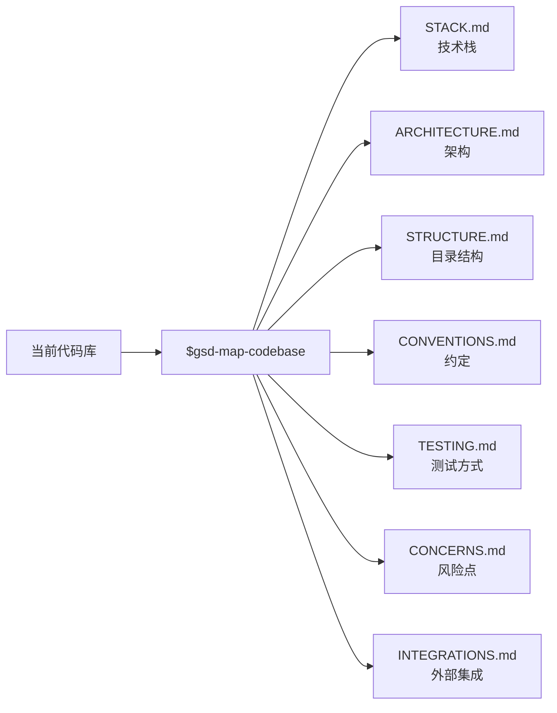
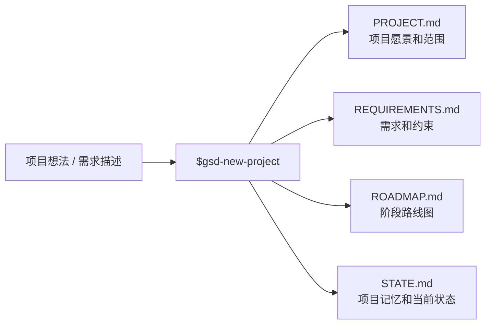
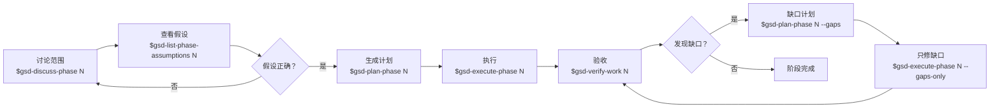
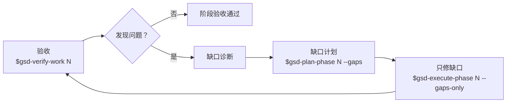
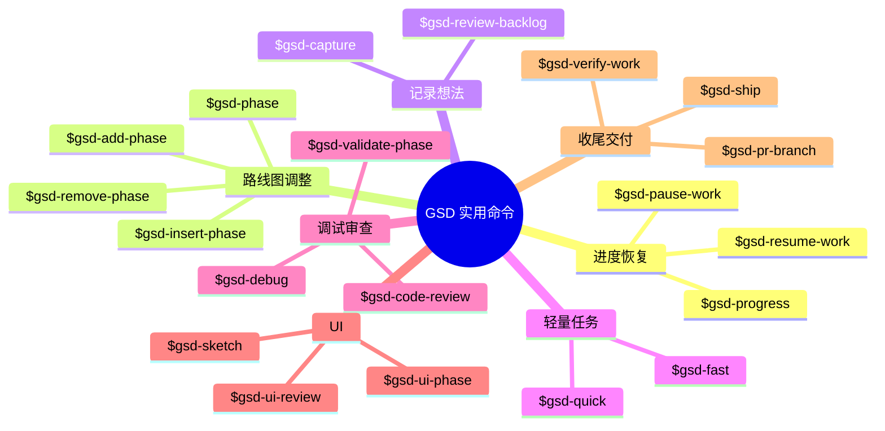
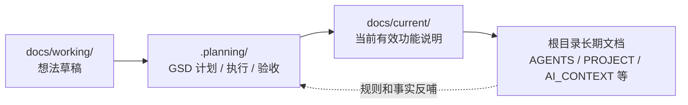
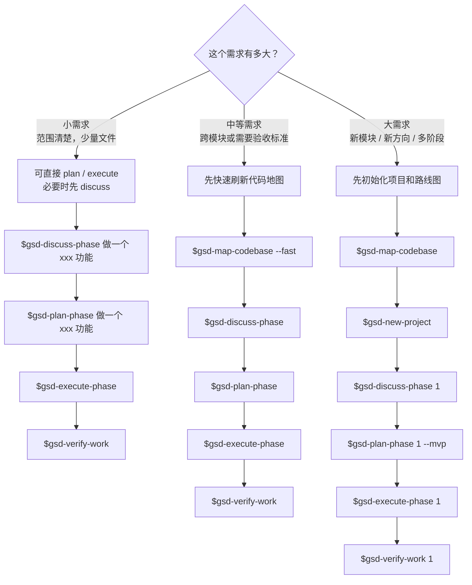
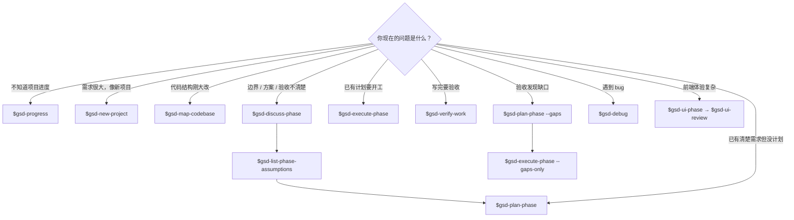

# GSD 使用指南

本文说明如何使用 GSD 做需求拆解、计划、执行和验收。

GSD 的作用不是替代代码实现，而是把“想法”变成可追踪的项目上下文、阶段路线图、执行计划和验收记录。日常新需求可以按本文流程推进。

## 一句话流程

```text
代码地图 → 项目初始化 → 阶段讨论 → 阶段计划 → 执行阶段 → 验收验证 → 修复缺口
```



最常用命令：

```text
$gsd-map-codebase      # 生成/刷新代码地图，让 AI 先理解现有项目
$gsd-new-project       # 初始化项目愿景、需求、路线图和状态文件
$gsd-discuss-phase     # 正式计划前先讨论阶段目标、边界和风险
$gsd-plan-phase        # 生成某个阶段的可执行 PLAN.md
$gsd-execute-phase     # 按 PLAN.md 执行阶段任务
$gsd-verify-work       # 按用户视角验收，发现缺口后再修
```

## 什么时候用 GSD

适合使用 GSD：

1. 新功能从想法进入可开发状态。
2. 一个需求需要拆成多个阶段。
3. 需要让 AI 先理解现有代码，再规划改动。
4. 需求跨多个应用、服务、包、模块或测试。
5. 涉及认证、权限、数据模型、后台任务、API、前端体验等关键链路。
6. 上次做了一半，需要恢复上下文继续推进。
7. 做完功能后，需要按用户视角验收。

不一定需要 GSD：

1. 一行 typo。
2. 很小的纯文档改动。
3. 临时查一个文件、解释一段代码。
4. 明确知道要改哪一行的小修复。

## 第一步：确认代码地图

命令：

```text
$gsd-map-codebase
```

作用：

1. 分析当前代码库。
2. 生成 `.planning/codebase/` 下的代码地图。
3. 让后续规划阶段能引用真实结构，而不是凭印象猜。

输出文档：



```text
.planning/codebase/STACK.md
.planning/codebase/INTEGRATIONS.md
.planning/codebase/ARCHITECTURE.md
.planning/codebase/STRUCTURE.md
.planning/codebase/CONVENTIONS.md
.planning/codebase/TESTING.md
.planning/codebase/CONCERNS.md
```

如果当前项目已经生成过代码地图，短期内不用反复跑。以下情况再刷新：

1. 目录结构大改。
2. 新增重要应用、服务或共享包。
3. 技术栈变化。
4. 旧地图明显过期。

轻量刷新示例：

```text
$gsd-map-codebase --fast
$gsd-map-codebase --fast --focus tech
$gsd-map-codebase --fast --focus arch
```

## 第二步：初始化项目

命令：

```text
$gsd-new-project
```

作用：

1. 收集项目目标、范围、约束和偏好。
2. 生成 `.planning/PROJECT.md`。
3. 生成 `.planning/REQUIREMENTS.md`。
4. 生成 `.planning/ROADMAP.md`。
5. 生成 `.planning/STATE.md`。



适合场景：

1. 一个较大的新方向。
2. 一个需要多个阶段完成的模块。
3. 还没有清晰路线图的产品想法。

示例：

```text
$gsd-new-project 做一个账号认证模块，包括登录、设备管理、撤销和 API 权限校验
```

如果已经有比较完整的想法文档，可以让 GSD 基于该文档初始化。

```text
$gsd-new-project --auto @docs/working/xxx.md
```

## 第三步：讨论阶段

命令：

```text
$gsd-discuss-phase
```

作用：

1. 在正式写 `PLAN.md` 前，把这个阶段的目标、边界、默认选择和风险先聊清楚。
2. 让 AI 主动提出需要确认的问题，避免 plan 阶段把不确定点默默写死。
3. 把用户确认过的决策沉淀到 `.planning/` 对应阶段上下文里。
4. 适合把“我想要的使用方式”转换成后续可执行计划的约束。

常用方式：

```text
$gsd-discuss-phase 1
$gsd-discuss-phase 2
$gsd-discuss-phase
```

不传数字时，GSD 会尝试选择当前最需要讨论的阶段。

也可以在命令后面直接带上你想讨论的问题：

```text
$gsd-discuss-phase 1 Web 是否由后端服务托管？API 是否要单独部署？
$gsd-discuss-phase 6 我希望后台服务常驻，CLI 默认转发到它
```

什么时候一定建议先跑：

1. 阶段还没完全想清楚，只知道大方向。
2. 有多种方案需要取舍，例如服务是前台还是后台、Web 是否由 API 服务托管。
3. 涉及安全边界、认证、部署方式、数据模型或多用户权限。
4. 你想先用大白话确认“这个阶段做完到底能不能用”。
5. 前面计划已经过期，需要重新整理阶段范围。

典型用法：

```text
$gsd-discuss-phase 6
```

你也可以直接带问题：

```text
$gsd-discuss-phase 6 我想先把后台服务做成常驻进程，并且 CLI 默认转发到它
```

讨论完成后，通常接：

```text
$gsd-list-phase-assumptions 6
$gsd-plan-phase 6
```

`$gsd-list-phase-assumptions` 用来查看讨论后 AI 准备采用的假设，适合在正式计划前纠偏。

### 查看阶段假设

命令：

```text
$gsd-list-phase-assumptions 1
```

作用：

1. 看 AI 对这个阶段的默认理解，例如“Web 是否由后端托管”“服务是否部署到云端”。
2. 提前发现和你真实想法不一致的地方。
3. 在 `$gsd-plan-phase` 前把错误假设改掉，减少返工。

什么时候用：

1. `$gsd-discuss-phase` 后，正式 plan 前。
2. 阶段范围刚被你调整过。
3. 你觉得 AI “好像理解偏了”。
4. 要把后续阶段的内容提前混入当前阶段，或从某个阶段移除冲突内容。

示例：

```text
$gsd-list-phase-assumptions 6
```

如果看到不对的假设，直接回复纠正，再重新跑：

```text
$gsd-discuss-phase 6
$gsd-list-phase-assumptions 6
```

阶段内推荐闭环：



## 第四步：规划阶段

命令：

```text
$gsd-plan-phase
```

作用：

1. 从 `.planning/ROADMAP.md` 中选择阶段。
2. 补充阶段上下文。
3. 生成可执行的 `PLAN.md`。
4. 自动检查计划是否能达成阶段目标。

常用方式：

```text
$gsd-plan-phase 1
$gsd-plan-phase 2
$gsd-plan-phase
```

不传数字时，GSD 会尝试选择下一个未规划阶段。

常用参数：

```text
$gsd-plan-phase 1 --mvp
$gsd-plan-phase 2 --skip-research
$gsd-plan-phase 3 --research
$gsd-plan-phase 4 --prd docs/working/xxx.md
```

参数含义：

1. `--mvp`：按垂直切片规划，适合第一阶段先做可跑通的最小闭环。
2. `--skip-research`：跳过研究，直接规划。
3. `--research`：强制重新研究。
4. `--prd <file>`：基于已有 PRD 或验收标准规划。
5. `--gaps`：只规划验收后发现的缺口修复。

## 第五步：执行阶段

命令：

```text
$gsd-execute-phase
```

作用：

1. 读取某个阶段下的执行计划。
2. 分析任务依赖。
3. 按 wave 分批执行。
4. 必要时并行派发子任务。
5. 执行后更新阶段状态。

常用方式：

```text
$gsd-execute-phase 1
$gsd-execute-phase 2
```

只执行某一波：

```text
$gsd-execute-phase 1 --wave 1
$gsd-execute-phase 1 --wave 2
```

小修复或想边做边看时：

```text
$gsd-execute-phase 1 --interactive
```

只执行验收缺口修复：

```text
$gsd-execute-phase 1 --gaps-only
```

## 第六步：验收功能

命令：

```text
$gsd-verify-work
```

作用：

1. 按用户视角检查功能是否真的可用。
2. 记录 UAT 结果。
3. 如果发现问题，生成缺口诊断和修复计划。

常用方式：

```text
$gsd-verify-work 1
$gsd-verify-work
```

如果验收发现问题，后续通常接：

```text
$gsd-plan-phase 1 --gaps
$gsd-execute-phase 1 --gaps-only
```



## 实用命令补充

这些命令不是每个阶段都必须用，但在真实开发中很常见。



### 看进度和恢复上下文

```text
$gsd-progress
$gsd-resume-work
$gsd-pause-work
```

- `$gsd-progress`：看当前项目有哪些阶段、做到哪一步、下一步建议做什么。
- `$gsd-resume-work`：中断后恢复之前的 GSD 上下文。
- `$gsd-pause-work`：主动暂停当前工作，写下交接状态，方便下次继续。

常用场景：

```text
$gsd-progress
```

如果你不知道现在该执行 discuss、plan、execute 还是 verify，先跑这个。

### 调整路线图阶段

```text
$gsd-phase
$gsd-add-phase "新增阶段描述"
$gsd-insert-phase 7 "在第 7 阶段后插入一个阶段"
$gsd-remove-phase 3
```

- `$gsd-phase`：统一管理 ROADMAP 里的阶段，适合编辑、插入、删除或重排。
- `$gsd-add-phase`：在路线图末尾追加阶段。
- `$gsd-insert-phase`：在已有阶段之间插入新阶段。
- `$gsd-remove-phase`：删除还没开始的阶段。

常见场景：

```text
$gsd-phase 把后续阶段的设备管理调整到认证阶段，并新增多用户 / 托管服务 / 归属模型
```

### 记录临时想法

```text
$gsd-capture "想到一个点：后续要支持多用户 ownership"
$gsd-review-backlog
```

- `$gsd-capture`：先把想法记到合适位置，不立刻打断当前实现。
- `$gsd-review-backlog`：回头审查这些想法，决定是否提升到当前路线图。

### 轻量任务

```text
$gsd-fast "改一个 typo"
$gsd-quick "给 status 命令补一行中文输出"
```

- `$gsd-fast`：很小、很明确的任务，跳过完整阶段流程。
- `$gsd-quick`：小任务，但仍希望保留一点计划和验证。

如果任务会影响认证、权限、后台服务、API、数据模型或多文件协作，不建议用 fast，走
`discuss → plan → execute` 更稳。

### 调试和审查

```text
$gsd-debug "线上页面看不到最新数据"
$gsd-code-review 6
$gsd-validate-phase 6
```

- `$gsd-debug`：系统化排查 bug，并保留调试上下文。
- `$gsd-code-review`：按代码审查视角找 bug、安全问题和测试缺口。
- `$gsd-validate-phase`：回头检查阶段目标和验收覆盖是否真的达成。

### UI 相关阶段

```text
$gsd-ui-phase 3
$gsd-ui-review 3
$gsd-sketch "后台管理列表页"
```

- `$gsd-ui-phase`：前端阶段执行前生成 UI 设计契约。
- `$gsd-ui-review`：实现后做视觉和交互审计。
- `$gsd-sketch`：先用一次性 HTML 原型探索布局。

Web 页面、控制台、Dashboard、移动端视图这类需求，建议在 execute 前先跑
`$gsd-ui-phase`。

### 收尾和交付

```text
$gsd-verify-work 6
$gsd-ship 6
$gsd-pr-branch
```

- `$gsd-verify-work`：用户视角验收。
- `$gsd-ship`：准备 PR / 交付。
- `$gsd-pr-branch`：生成不含 `.planning/` 的干净 PR 分支，适合对外代码审查。

## 项目内规则

GSD 生成计划和执行代码时，必须遵守当前仓库规则。建议在项目根目录维护这些规则文件：

1. `AGENTS.md`：AI 协作入口和规则优先级。
2. `PROJECT.md`：项目专属命令、约束和安全边界。
3. `AI_CONTEXT.md`：架构背景和长期上下文。
4. `docs/README.md`：文档目录和维护规则。

通用建议：

1. 开始前先读项目规则文件和相关模块文档。
2. 使用项目指定的包管理器和测试命令。
3. 修改范围保持在当前任务内，不顺手重构无关代码。
4. 涉及安全、认证、权限、数据迁移或外部接口时，先讨论边界再计划。
5. 涉及长期事实时，同步回写 `docs/current/` 或项目约定的长期文档。

## 与项目文档的关系

建议把 `docs` 作为当前事实来源，把 `.planning` 作为 GSD 的计划、执行和验收工作区。

```text
docs/working/ → .planning/ → docs/current/ → 根目录长期文档
```



建议这样配合：

1. 还在想方向：先写 `docs/working/YYYY-MM-DD-<topic>.md`，必要时用 GSD 帮忙梳理。
2. 确认要开发：用 GSD 生成 `.planning/` 里的阶段计划和验收项。
3. 进入执行：以 GSD 的 `PLAN.md`、用户最新确认和代码现状为准。
4. 做完后：把长期有效事实沉淀到 `docs/current/`、`AI_CONTEXT.md`、`PROJECT.md` 或项目约定的长期文档。

## 日常新需求推荐流程



### 小需求

适合：范围清楚、只影响少量文件、没有复杂产品探索。

```text
$gsd-discuss-phase 做一个 xxx 功能
$gsd-plan-phase 做一个 xxx 功能
$gsd-execute-phase
$gsd-verify-work
```

也可以直接说：

```text
帮我按 GSD 规划并实现 xxx
```

### 中等需求

适合：需要前后端协作、涉及测试、需要明确验收标准。

```text
$gsd-map-codebase --fast
$gsd-discuss-phase 做一个 xxx 功能
$gsd-plan-phase 做一个 xxx 功能
$gsd-execute-phase
$gsd-verify-work
```

### 大需求

适合：一个新模块、一个新产品方向、需要多个阶段。

```text
$gsd-map-codebase
$gsd-new-project
$gsd-discuss-phase 1
$gsd-plan-phase 1 --mvp
$gsd-execute-phase 1
$gsd-verify-work 1
```

后续阶段：

```text
$gsd-discuss-phase 2
$gsd-plan-phase 2
$gsd-execute-phase 2
$gsd-verify-work 2
```

## 常用说法

你可以直接这样发给 AI：

```text
$gsd-map-codebase
```

```text
$gsd-new-project 做一个 xxx 模块
```

```text
$gsd-plan-phase 1 --mvp
```

```text
$gsd-discuss-phase 1
```

```text
$gsd-list-phase-assumptions 1
```

```text
$gsd-progress
```

```text
$gsd-capture "先记一下：xxx"
```

```text
$gsd-debug "xxx 不工作"
```

```text
$gsd-code-review 1
```

```text
$gsd-ui-phase 1
```

```text
$gsd-ui-review 1
```

```text
$gsd-execute-phase 1
```

```text
$gsd-verify-work 1
```

```text
按 GSD 给我规划这个需求：xxx
```

```text
继续执行当前 GSD 阶段
```

```text
只修 GSD 验收里发现的问题
```

## 生成物位置

GSD 主要写入 `.planning/`：

```text
.planning/PROJECT.md
.planning/REQUIREMENTS.md
.planning/ROADMAP.md
.planning/STATE.md
.planning/codebase/
.planning/research/
.planning/phases/
```

阶段执行过程中还会生成阶段目录、计划、总结、验证记录和 UAT 记录。具体位置由 GSD 当前配置和 roadmap 决定。

阶段目录示例：

```text
.planning/phases/01-first-mvp/
.planning/phases/02-auth-and-access/
```

## 推荐默认策略

如果你不确定该用哪个命令：



1. 已经有清楚需求，但没有计划：用 `$gsd-plan-phase`。
2. 需求方向有了，但边界、方案或验收还没聊清楚：先用 `$gsd-discuss-phase`。
3. 讨论后想确认 AI 的默认假设：用 `$gsd-list-phase-assumptions`。
4. 不知道当前项目做到哪里：用 `$gsd-progress`。
5. 需求很大，像一个新项目：用 `$gsd-new-project`。
6. 代码结构刚大改：先用 `$gsd-map-codebase`。
7. 已经有计划，要开始写代码：用 `$gsd-execute-phase`。
8. 已经写完，要确认能不能用：用 `$gsd-verify-work`。
9. 遇到 bug 要系统排查：用 `$gsd-debug`。
10. 前端体验复杂：执行前用 `$gsd-ui-phase`，完成后用 `$gsd-ui-review`。

## 验证命令参考

执行阶段完成后，至少根据影响范围选择验证：

```text
npm test
npm run typecheck
npm run lint
npm run build
```

按项目实际技术栈替换上面的命令。涉及认证、权限、后台任务、API、WebSocket、支付、数据迁移或部署链路的改动，不能只看类型检查；需要实际启动相关服务，验证关键用户路径和失败场景。
