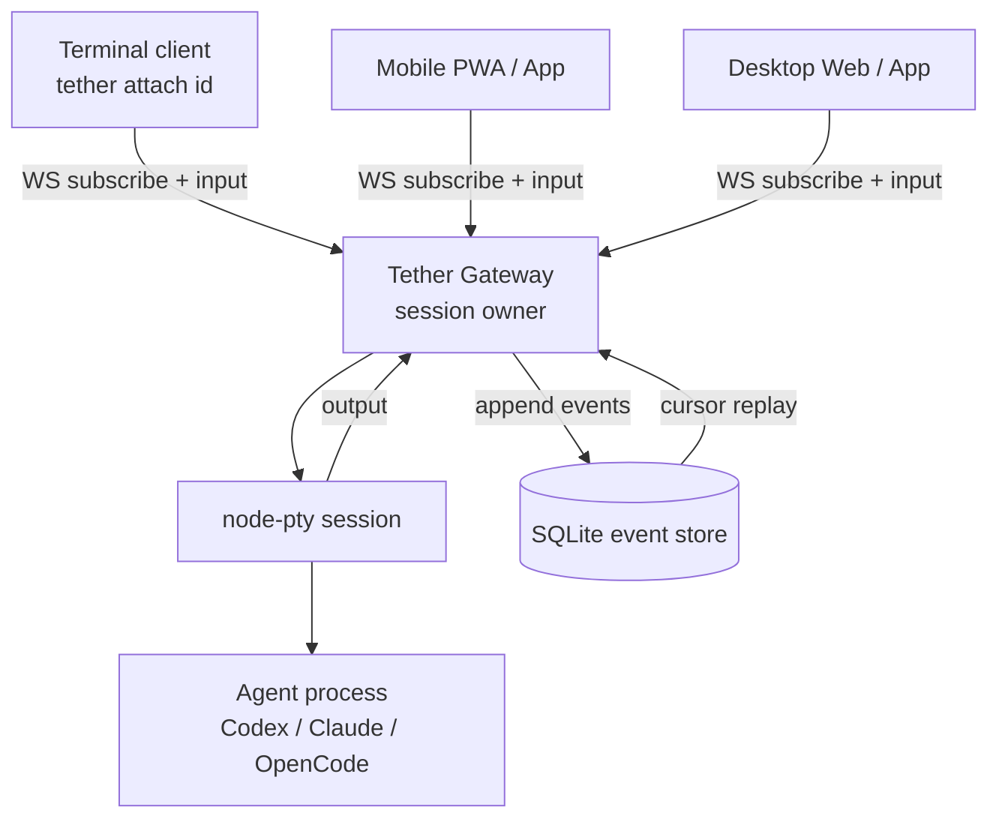

# Phase 2：PTY-backed Event Stream（草案）

> 状态：Working / 待讨论。
> 目的：记录 Phase 2 如何从 tmux 迁移到 Gateway-owned PTY event stream，
> 并给出任务拆分与验收标准。正式开发时应转成 GSD 阶段计划。

## 1. 目标

Phase 2 的目标是替换 Tether 当前对 tmux 的 session transport 依赖：

```text
tmux new-session
tmux attach
tmux capture-pane
tmux send-keys
```

替换为：

```text
Gateway spawn agent in PTY
PTY output -> append-only events
clients subscribe events
client input -> Gateway -> PTY stdin
```

用户心智尽量保持稳定：

```bash
tether codex
tether claude
tether run codex
tether attach <id>
tether send <id> "继续"
tether stop <id>
```

长期语义：

```text
tether codex = tether run codex + tether attach <new-session-id>
```

本地开发体验目标要更明确：

```text
在 Tether 覆盖的 agent session 场景里，本地使用体验要尽量完全对齐 tmux，
并在历史回放、多端接管、审计、手机/Web/App 接入这些 agent console 能力上超越 tmux。
```

这意味着 Phase 2 不能只实现“能跑”。它必须把本地终端手感作为硬指标：

- `tether codex` 进入交互的速度和心智接近当前 `tmux attach`。
- 常用交互键（Enter / Backspace / Ctrl-C / Ctrl-D / paste）必须稳定。
- ANSI、颜色、光标移动、清屏、alternate screen 和长输出不能明显劣化。
- attach / detach 语义必须清楚，detach 不 kill agent。
- resize、多端观察、断线重连和大输出性能必须有明确策略。
- Gateway 崩溃 / 重启时的 session 状态必须可解释，不能静默丢状态。

## 2. 非目标

Phase 2 不重写完整 tmux，也不做完整 IDE 化：

- 不做 pane split / window manager。
- 不做 tmux prefix / keybinding 生态。
- 不做 tmux plugin。
- 不做任意远程 shell。
- 不做完整 diff UI / file tree / orchestration UI。
- 不把手机/Web 客户端升级成可执行任意命令的远程终端。

设计原则：

```text
Replace tmux as Tether's session transport,
not as a general terminal multiplexer.
```

中文表述：

```text
替换 tmux 在 Tether 里的 session transport 角色，
不是重写一个通用 tmux。
```

## 3. 核心架构



Gateway 是唯一 session owner。所有 UI 都只是 attach point。

## 4. 模块拆分

建议新增模块：

```text
apps/gateway/src/
  session-manager.ts    # session 生命周期
  pty-session.ts        # node-pty wrapper
  event-store.ts        # SQLite event append/read
  event-stream.ts       # WS subscribe / cursor / broadcast
  input-router.ts       # client input -> PTY
  client-registry.ts    # attached clients / active controller / presence
  terminal-size.ts      # resize 策略
```

Phase 2 后 `tmux.ts` 退出主路径。开发迁移期可以保留 debug fallback，
但产品正式路径不应长期保留 tmux / PTY 双管线。

## 5. 数据模型

### Session

```ts
type Session = {
  id: string
  provider: 'codex' | 'claude' | 'opencode'
  title: string
  projectPath: string
  status: 'running' | 'stopped' | 'completed' | 'failed' | 'lost'
  attachState: 'attached' | 'detached'
  command: string
  pid?: number
  transport: 'tmux' | 'pty-event-stream'
  createdAt: number
  updatedAt: number
  lastActiveAt: number
}
```

`status` 描述 agent process / session 生命周期；`attachState` 描述是否有 client
连接。不要用 `detached` 表示 session 状态，否则会混淆“agent 仍在 running，
只是没有客户端 attach”的场景。

`lost` 用于 Gateway 重启后无法重新接管的历史 session。`recoverable` 不进入
第一版 status 枚举；如果后续实现 supervisor / process recovery，再单独引入。

`transport` 在迁移期用于区分 `tmux` 与 `pty-event-stream`。Phase 2C 默认切到
PTY 后，应评估是否删除该字段，或保留为未来 transport 扩展点。

### Event

最小事件集合：

```ts
type SessionEvent =
  | SessionStartedEvent
  | TerminalOutputEvent
  | UserInputEvent
  | ClientAttachedEvent
  | ClientDetachedEvent
  | TerminalResizeEvent
  | ClientControlChangedEvent
  | SessionExitedEvent
  | SessionErrorEvent
```

```ts
type BaseEvent = {
  id: number
  sessionId: string
  type: string
  ts: number
}

type TerminalOutputEvent = BaseEvent & {
  type: 'terminal.output'
  data: string
  encoding: 'utf8'
}

type UserInputEvent = BaseEvent & {
  type: 'user.input'
  clientId: string
  data: string
  encoding: 'utf8'
}

type SessionStartedEvent = BaseEvent & {
  type: 'session.started'
  provider: string
  command: string
  projectPath: string
  pid: number
  cols: number
  rows: number
}

type SessionExitedEvent = BaseEvent & {
  type: 'session.exited'
  exitCode: number | null
  signal: string | null
}

type ClientAttachedEvent = BaseEvent & {
  type: 'client.attached'
  clientId: string
  deviceName: string
  surface: 'cli' | 'web' | 'mobile' | 'desktop-app' | 'native-app'
  mode: 'control' | 'observe'
  cols?: number
  rows?: number
}

type ClientDetachedEvent = BaseEvent & {
  type: 'client.detached'
  clientId: string
  reason: 'disconnect' | 'detach' | 'timeout'
}

type TerminalResizeEvent = BaseEvent & {
  type: 'terminal.resize'
  clientId: string
  cols: number
  rows: number
}

type ClientControlChangedEvent = BaseEvent & {
  type: 'client.control_changed'
  clientId: string | null
  previousClientId: string | null
  cols: number
  rows: number
  reason: 'attach' | 'claim' | 'disconnect' | 'manual' | 'fallback'
}

type SessionErrorEvent = BaseEvent & {
  type: 'session.error'
  code: string
  message: string
}
```

第一版 `terminal.output.data` 用 UTF-8 string。保留扩展：

```ts
encoding: 'utf8' | 'base64'
```

遇到 binary / 非 UTF-8 再切 base64。

### SQLite

```sql
CREATE TABLE sessions (
  id TEXT PRIMARY KEY,
  provider TEXT NOT NULL,
  title TEXT NOT NULL,
  project_path TEXT NOT NULL,
  status TEXT NOT NULL,
  command TEXT NOT NULL,
  pid INTEGER,
  transport TEXT NOT NULL,
  created_at INTEGER NOT NULL,
  updated_at INTEGER NOT NULL,
  last_active_at INTEGER NOT NULL
);

CREATE TABLE session_events (
  id INTEGER PRIMARY KEY AUTOINCREMENT,
  session_id TEXT NOT NULL,
  type TEXT NOT NULL,
  ts INTEGER NOT NULL,
  payload_json TEXT NOT NULL,
  FOREIGN KEY (session_id) REFERENCES sessions(id)
);

CREATE INDEX idx_session_events_cursor
ON session_events(session_id, id);
```

## 6. PTY 生命周期

创建：

```text
createSession(provider, cwd)
  -> resolve command: codex / claude / opencode
  -> node-pty.spawn(command, args, { cwd, cols, rows, env })
  -> insert sessions
  -> append session.started
  -> onData -> append terminal.output + broadcast
  -> onExit -> append session.exited + update status
```

输入：

```text
client sends terminal input
  -> auth check
  -> session exists and running
  -> append user.input
  -> pty.write(data)
  -> update lastActiveAt
```

停止：

```text
tether stop <id>
  -> Gateway kills PTY process
  -> append session.exited / session.stopped
```

断开：

```text
client disconnect
  -> append client.detached
  -> agent keeps running
```

## 7. WebSocket / HTTP 协议

### WebSocket

连接：

```text
POST /api/ws-ticket
Authorization: Bearer <device-token>
  -> { ticket, expiresAt }

GET /api/sessions/:id/stream?after=<eventId>&ticket=<one-time-ticket>
```

浏览器原生 WebSocket API 不能设置自定义 `Authorization` header，因此 Web 端
不能依赖 `Authorization: Bearer` 直接建立 WS。第一版采用短期一次性 ticket：

- 客户端先用 HTTP + Bearer token 换取 WS ticket。
- ticket 有效期建议 60 秒。
- ticket 使用一次后失效。
- ticket 出现在 query string，必须避免在访问日志中明文记录；Gateway 日志要做
  query token/ticket mask。

CLI / native 客户端如果使用支持自定义 header 的 WS 库，也可以走 Bearer header；
但协议基线以 browser-compatible ticket 为准。`Sec-WebSocket-Protocol` 可作为
后续替代方案评估，不作为第一版默认。

服务端先发送 cursor 之后的历史事件，再接入 live broadcast。

```ts
type ServerFrame =
  | {
      type: 'hello'
      sessionId: string
      clientId: string
      latestEventId: number
      controllerClientId: string | null
    }
  | { type: 'event'; event: SessionEvent }
  | { type: 'error'; code: string; message: string }

type ClientFrame =
  | { type: 'input'; data: string; encoding?: 'utf8' }
  | { type: 'resize'; cols: number; rows: number }
  | { type: 'claim-control' }
  | { type: 'release-control' }
```

`clientId` 由 Gateway 在 WS 建连后分配，并通过 `hello` frame 返回。客户端后续
发送 input / resize / claim-control 时不需要自报 `clientId`；Gateway 从连接上下文
补入事件，避免客户端伪造别的设备身份。

### HTTP

```text
GET  /api/sessions
POST /api/sessions
POST /api/ws-ticket
GET  /api/sessions/:id/events?after=123&limit=1000
GET  /api/sessions/:id/stream
POST /api/sessions/:id/input
POST /api/sessions/:id/resize
POST /api/sessions/:id/stop
GET  /api/sessions/:id/transcript?tail=200
```

`events` 列表接口限制：

- 默认 `limit=1000`
- 最大 `limit=5000`
- 超过最大值时按 5000 截断，或返回 400；实现时二选一并写入 API 文档。

Phase 1 的接口可暂时兼容：

```text
GET  /api/sessions/:id/snapshot
POST /api/sessions/:id/send
```

兼容实现：

- `snapshot` 从 `terminal.output` events 拼 transcript。
- `send` 走 input router。

## 8. CLI attach

`tether attach <id>` 是本地 terminal client。

行为：

```text
1. 打开 WS
2. 请求 after=last known cursor 或 0
3. stdout 写 terminal.output
4. stdin 进入 raw mode
5. stdin data 发 input frame
6. terminal resize 发 resize frame
7. process exit / terminal close = detach，不 kill agent
```

伪代码：

```ts
process.stdin.setRawMode(true)
process.stdin.on('data', chunk => {
  ws.send(JSON.stringify({
    type: 'input',
    data: chunk.toString('utf8')
  }))
})

ws.on('message', frame => {
  if (frame.type === 'event' && frame.event.type === 'terminal.output') {
    process.stdout.write(frame.event.data)
  }
})
```

默认语义：

- `Ctrl-C` / `Ctrl-D` 透传给 agent。
- 关闭 attach client = detach。
- `tether stop <id>` 才 kill session。
- detach 快捷键在 Phase 2A 内实现；初版备选 `Ctrl-]` 或 command mode。

本地多窗口建议命令：

```bash
tether attach <id>             # 默认 attach；按控制策略决定是否成为 controller
tether attach <id> --control   # 显式以主控方式 attach
tether attach <id> --observe   # 显式只读观察，不抢占 size / input focus
tether clients <id>            # 查看当前 attached clients / controller
```

## 9. Resize 与输入仲裁

PTY 只有一个 size，多端尺寸可能不同。

初始尺寸策略：

- `tether codex` / `tether claude` 是 run + attach 快捷方式，CLI 在创建 session 前
  已经知道当前终端 `cols/rows`，必须把初始 `cols/rows` 传给 create session。
- Gateway spawn PTY 时使用该初始尺寸，避免先用 `120x40` 初始化再立即 resize，
  导致 Codex / Claude TUI 启动阶段重排。
- 后台创建的 `tether run <provider> --no-attach` 没有 controller，才使用默认
  `120x40`。
- Web / mobile 创建 session 时也应传 viewport 推导出的初始 terminal size；
  没有可用尺寸时才回退 `120x40`。

第一版采用：

```text
active controller owns size
```

规则：

- 新 session 默认 `120x40`。
- 第一个 attach 的 terminal client 自动成为 active controller。
- active controller resize 才调用 `pty.resize(cols, rows)`。
- 其他 client resize 只记录 presence，不改 PTY。
- observer 可以显式 `claim-control`。
- Web / mobile 默认观察，点击输入框或发送输入时按客户端策略申请控制权。
- 本地 terminal 可通过 `tether attach <id> --control` 显式抢占控制权。
- 本地 terminal 可通过 `tether attach <id> --observe` 显式只读观察。
- 当前 active controller 断开后，最近活跃的 terminal client 可自动接管；若没有可接管 client，则 session 保持无 controller，PTY size 回到默认或保持最后尺寸。
- control 切换产生 `client.control_changed` event。

多本地窗口体验：

```text
多个本地终端窗口可以 attach 同一个 session。
每个 session 同时只有一个 active controller。
active controller 拥有 PTY size 和主输入焦点。
observer 接收同一条事件流，但不改变 PTY size。
observer 可以显式抢占控制权，或在输入时按客户端策略申请控制权。
```

示例：

```text
iTerm 窗口 A：120x40，active controller
VS Code Terminal 窗口 B：100x28，observer
手机窗口 C：45x20，observer

PTY size = A 的 120x40
A resize 会触发 pty.resize
B / C resize 只更新 presence，不影响 A
B / C claim control 后，PTY size 才切到对应尺寸
```

observer 显示策略：

- 本地 terminal observer：直接输出同一事件流，不主动 resize，依赖宿主终端表现。
- Web / mobile observer：显示当前 controlled size，可横向滚动、缩放或提示“由某设备控制”。

输入仲裁第一版不做强锁：

```text
所有已授权 client 都可以输入。
Gateway 按收到顺序写入 PTY。
event 记录 clientId。
UI 显示 last input from <device>.
```

后续加：

```text
focus mode / soft lock
```

## 10. 历史回放与 retention

客户端重连：

```text
lastEventId = 1024
GET /stream?after=1024
```

客户端 cursor 持久化：

- CLI attach 可以只在进程内维护 latestEventId；下一次手动 attach 可从 0 或
  transcript tail 开始。
- Web / PWA 刷新页面会丢内存状态，第一版使用 `localStorage` 按
  `sessionId + deviceId` 保存 latestEventId。
- 后续可由 Gateway 按 device 记录 last seen cursor，但不是 Phase 2A 必需项。

服务端：

```text
1. 读 session_events where id > 1024
2. 逐条发送
3. 接入 live broadcast
```

第一版可直接落 SQLite。后续需要 retention：

- 默认保留最近 7 天或每 session 100MB，先达到者触发清理。
- completed session 可 compact 成 transcript。
- 单次 cursor replay 默认 1000 events，最大 5000 events。
- 内部 backfill 可支持更大批次，但对外 API 不超过 5000 events。
- 超过 replay limit 时要求走 transcript/snapshot。

## 11. Secret Mask

默认路径：

```text
PTY output -> mask -> event store -> clients
user input -> mask -> event store
user input -> original bytes -> PTY stdin
```

理由：

- DB 默认不保存常见 token / secret 明文。
- 客户端外发内容也复用同一份 masked event。
- 用户粘贴 token / API key 是常见场景，`user.input` 落库前也必须 mask。
- 写入 PTY 的输入仍使用原始 bytes，不能把 mask 后的内容发给 agent。

如需本机 raw log，后续用显式 debug mode，不作为默认行为。

## 12. 安全边界

写操作必须认证：

```text
input
resize
stop
claim-control
release-control
```

Gateway 只能启动白名单 provider：

```text
codex
claude
opencode
```

provider binary 解析规则：

- 客户端只能传 provider id，不能传 command path 或 args。
- Gateway 本地根据配置解析 provider binary，可使用固定路径或受控 PATH lookup。
- 解析结果必须落入 provider whitelist，并记录实际 resolved path。
- `PATH` lookup 只允许使用 Gateway 启动时的受控 env，不接受客户端传入 env 覆盖。

禁止提供：

```text
POST /api/exec
POST /api/run-shell
```

客户端不能传任意 command 让 Gateway 执行。

## 13. 与 tmux 能力对齐范围

### 必须对齐的本地体验

这些能力是 Phase 2 的硬目标。没有这些，用户会觉得从 tmux 退步：

- session keepalive
- attach / detach
- multi-client observe
- input forwarding
- `Ctrl-C` / `Ctrl-D` passthrough
- `Enter` / `Backspace` / paste
- ANSI color / cursor movement / clear screen
- alternate screen 的基本支持
- history
- resize
- stop
- 大输出下的流畅度和 backpressure
- Gateway crash / restart 后的状态可解释性

### 应该超越 tmux 的 agent console 能力

这些不是 tmux 的目标，但必须成为 Tether 替换 tmux 的价值来源：

- event cursor replay，而不是近似 `capture-pane`。
- transcript / timeline / audit trail。
- phone / web / app 原生接入。
- attached clients / presence / last input source。
- active controller / input ownership。
- relay-friendly stream。
- 后续 diff / approval / handoff / verification loop 的结构化事件入口。

### 不对齐的通用 tmux 能力

这些能力不进入 Phase 2 目标，因为 Tether 不是通用 terminal multiplexer：

- split pane
- window manager
- prefix keybinding
- copy mode
- tmux plugins
- generic shell multiplexer

### 本地开发体验差异与设计要求

| 体验点 | tmux 当前 | Phase 2 Tether 要求 |
| --- | --- | --- |
| 启动 | `tether codex` 后 `tmux attach` | `tether codex` 后 Tether attach，心智不变 |
| 终端原味 | tmux 很成熟 | 必须接近 tmux，不能破坏 Codex / Claude 常见 TUI |
| detach | `Ctrl-b d` | Tether 自定义 detach；关闭 attach client = detach |
| attach | `tmux attach` | `tether attach <id>` |
| 多窗口尺寸 | tmux 成熟处理 | `active controller owns size`，非主控只观察 |
| copy mode | tmux 内置 | Phase 2 不做，靠宿主终端 / Web selection / transcript |
| 历史 | scrollback / capture-pane | event store + cursor + transcript，目标更强 |
| 稳定性 | tmux server 很稳 | Gateway 需要 supervisor / 状态恢复策略 |
| 延迟 | 本地极低 | loopback WS 需接近无感，必须处理 backpressure |
| 手机/Web | 抓屏式能力弱 | 原生 event stream，更强 |

## 14. 任务拆分

### 当前实现记录（2026-05-01）

已完成并通过本地验证：

- PTY event stream 已成为默认 transport；`tether codex` / `tether claude` /
  `tether opencode` 默认走 Gateway-owned `node-pty`。
- `tether run <provider> --no-attach`、`tether attach <id> --control|--observe`、
  `tether clients <id>`、`tether stop <id>` 已可用。
- Web 端默认使用 WebSocket，一次性 ticket 通过 HTTP 换取；列表页提供 HTTP
  fallback 全局选择。
- Web 端使用 xterm.js 渲染 terminal output，支持输入、Stop、Control/Observe
  模式、client/controller 状态展示和移动端基础布局。
- Gateway 会在启动后将没有 live PTY handle 的历史 `running` PTY session 标记为
  `lost`，避免 Web 列表把不可接管的 session 当作活跃会话展示。
- 已补单元/集成测试：lost session 标记、observe WS 禁写、stop endpoint、PTY
  output/input mask、event cursor。
- 已跑验证：`pnpm typecheck`、`pnpm test`、`pnpm web:build`、`git diff --check`，
  以及本地 Gateway + `/bin/cat` PTY + WebSocket input echo 冒烟。

当前明确未完成 / 仍需设计：

- `tether gateway` 目前是前台空 Gateway，不是完整 supervisor。它能托管 Web/API，
  但还不能作为唯一进程接收“创建 session”请求并统一持有所有 PTY session。
- 多个 `pnpm tether run codex --no-attach` 可以启动多个 session，但每个 session
  仍由创建它的 CLI/Gateway 进程持有；当前建议并发时使用不同端口。
- detach 快捷键 / command mode 还没做；现在关闭 attach client 表示 detach，
  `Ctrl-C` / `Ctrl-D` 仍透传给 agent。
- bracketed paste、alternate screen、复杂 TUI resize 还需要专项验证和修复。
- event retention、device-token auth、完整 pairing、后台 supervisor / launchd、
  以及 tmux fallback 最终下线仍未完成。

### Phase 2A：PTY Event Stream Core

- [x] 新增 `node-pty` 依赖，确认 macOS 本地安装和 pnpm 构建流程。
- [x] 新增 `PtySession`，支持 spawn / write / resize / kill / onData / onExit。
- [x] 扩展 sessions 表，加入 `pid`、`transport` 等字段。
- [x] 新增 `session_events` 表和 `EventStore`。
- [x] 实现完整最小事件 union：`terminal.output`、`user.input`、`session.started`、`session.exited`、`client.attached`、`client.detached`、`terminal.resize`、`client.control_changed`、`session.error`。
- [x] 实现 session manager：创建、查询、停止 PTY session。
- [x] 实现 WebSocket stream：`after` cursor replay + live broadcast。
- [x] 实现 browser-compatible WS ticket：HTTP Bearer 换一次性 ticket，WS query 使用 ticket。
- [x] Gateway 在 WS `hello` frame 分配并返回 `clientId`。
- [x] 实现 input router：WS / HTTP input 写入 PTY。
- [x] 实现 `tether run <provider>`。
- [x] `tether codex` / `tether claude` 创建 session 时传入当前 terminal `cols/rows`，避免启动后 flash resize。
- [x] 实现 `tether attach <id>` 本地 raw terminal client。
- [x] 实现 `tether attach <id> --control` 和 `--observe` 的 CLI 语义。
- [x] 实现 `tether clients <id>`，展示 attached clients、active controller、last input source。
- [x] 实现本地 detach 语义：关闭 attach client 不 kill agent；`Ctrl-C` / `Ctrl-D` 默认透传。
- [ ] 设计并实现 Tether detach 快捷键或命令模式，避免复刻 tmux prefix。
- [ ] 验证 ANSI color、cursor movement、clear screen、alternate screen 基本行为。
- [ ] 验证 paste / bracketed paste 的第一版策略。
- [x] 保留 `tether codex` / `tether claude` 作为 run + attach 快捷方式。
- [x] Web 端用 xterm.js 渲染 `terminal.output`，并用 transcript 兜底显示 Codex TUI 输出。
- [x] 从 event store 生成 transcript，替代 `capture-pane` snapshot。
- [x] 实现 output chunk 合批和 backpressure，慢客户端不能拖慢 PTY 主路径。
- [x] 为 PTY session、event store、WS ticket、input router、CLI attach 写最小单元/集成测试。

### Phase 2B：Reconnect / Presence / Resize

- [x] 实现 client registry：clientId、device name、attachedAt、lastSeenAt。
- [x] 实现 `client.attached` / `client.detached` events。
- [x] 实现 `active controller owns size`。
- [x] 实现 `terminal.resize` / `client.control_changed` events。
- [x] 实现 observer / controller 模式：observer 不改变 PTY size，controller 才能 resize。
- [x] 实现 controller 断开后的接管策略：最近活跃 terminal client 自动接管或进入无 controller 状态。
- [x] Web / mobile observer 显示当前 controller / client 状态。
- [x] Web / CLI 显示当前 active controller / last input source。
- [x] 实现 reconnect cursor：客户端保存 latestEventId，断线后续接。
- [x] Web / PWA 用 `localStorage` 按 `sessionId` 保存 latestEventId；后续 device
  维度需要在 pairing 落地后补。
- [x] 为 replay 设置默认 1000 / 最大 5000 events，超过后提示走 transcript。
- [ ] 实现 event retention 初版配置：7 天或每 session 100MB，先达到者清理。
- [x] 定义并实现 Gateway restart 后不可接管 PTY session 标记为 `lost`；如需可恢复语义，另写 recovery 设计而不是混入 status 枚举。
- [ ] 评估 macOS launchd / supervisor 方案，确保 Gateway 作为 session owner 足够稳定。
- [ ] 为 reconnect、presence、resize ownership、replay limit、retention 写更完整集成测试。

### Phase 2C：安全与兼容收口

- [ ] 将 input / resize / stop / claim-control 纳入 device token auth。
- [x] 确认 Gateway 默认仍只绑定 `127.0.0.1`。
- [x] 确认 LAN 暴露必须显式 `--host 0.0.0.0`。
- [x] 确认 Gateway 只能启动白名单 provider，不能执行任意 command。
- [x] provider binary 只能由 Gateway 根据白名单解析；客户端不能传 command path / args / env。
- [x] 将 PTY output 和 user.input 落库前走 secret mask；写入 PTY 的 input 保留原始 bytes。
- [x] Phase 1 `snapshot` / `send` 兼容接口改走 event store / input router。
- [x] 默认 transport 切到 `pty-event-stream`。
- [x] tmux 退出默认主路径；当前仅通过 `--transport tmux` 作为迁移期 fallback。
- [ ] tmux fallback 最终下线，不进入正式产品路径。
- [ ] 评估是否删除 `transport` 字段，或保留为未来 transport 扩展点。
- [ ] 为 auth、provider whitelist、secret mask、旧接口兼容写安全/集成测试。

### Phase 2D：结构化事件占位

- [x] 预留 structured event 类型命名空间。
- [x] 增加 `approval.requested` event skeleton。
- [x] 增加 `diff.detected` event skeleton。
- [x] 增加 `agent.handoff` event skeleton。
- [ ] 文档说明 Phase 4 才实现完整 diff / approval UI。
- [ ] 为 structured event parser / exhaustive switch 写类型测试，确保新增事件不会漏分支。

## 15. 验收标准

### Phase 2A 验收

- [x] `tether run codex` 创建 `pty-event-stream` session。
- [x] `tether attach <id>` 可交互使用 Codex。
- [x] `tether codex` 等价于 run + attach。
- [x] 本地进入交互的体感接近当前 tmux attach，不出现明显额外等待。
- [x] `tether codex` 初始 PTY size 使用当前终端 cols/rows，不出现 120x40 后立即 resize 的 TUI flash。
- [x] WS 使用一次性 ticket 或等价 browser-compatible 认证方式；浏览器客户端不依赖自定义 Authorization header。
- [x] WS `hello` 返回 Gateway 分配的 `clientId`，`user.input` event 的 clientId 不由客户端自报。
- [x] Web xterm.js 可以看到同一 session 输出。
- [x] Web 输入能进入同一个 agent process。
- [x] 关闭 Web / CLI attach 后，agent 不退出。
- [x] 重新 attach 能从 event cursor 补历史。
- [ ] `Enter` / `Backspace` / `Ctrl-C` / `Ctrl-D` 行为符合预期。
- [ ] paste 大段文本不会乱码、截断或把控制字符错误解释为 Tether 命令。
- [ ] ANSI color、cursor movement、clear screen、alternate screen 常见行为可用。
- [x] 大输出不会导致本地 attach 明显卡死；慢 Web 客户端不会阻塞 PTY 输出主路径。
- [x] agent 退出后 session 状态更新为 `completed` 或 `failed`。
- [x] 主流程不再依赖 tmux。

### Phase 2B 验收

- [x] 多个客户端可以同时观察同一个 session。
- [x] 多个本地终端窗口可以同时 `tether attach <id>` 同一个 session。
- [x] `tether attach <id> --observe` 不抢占 controller，不改变 PTY size。
- [x] `tether attach <id> --control` 可以显式成为 active controller。
- [x] `tether clients <id>` 能显示当前 controller 和 attached clients。
- [x] active controller 的 resize 会更新 PTY size。
- [x] 非 active controller 的 resize 不会扰乱主控端。
- [x] active controller 断开后，系统按策略自动接管或进入无 controller 状态，且 UI/CLI 可见。
- [x] UI 能显示当前 active controller / last input source。
- [x] 客户端断线后用 `after=<eventId>` 续接不丢主要输出。
- [x] replay 超限时能通过 snapshot/transcript 接口降级查看近期输出。
- [x] 不同尺寸客户端同时 attach 时，主控端布局不被旁观端 resize 打乱。
- [x] Gateway 异常退出后的既有 session 状态不会静默伪装为 running。

### Phase 2C 验收

- [ ] 未认证客户端不能 input / resize / stop。
- [x] 默认 Gateway 仍只监听 `127.0.0.1`。
- [x] `--host 0.0.0.0` 仍需显式传入。
- [x] 客户端无法让 Gateway 执行任意 shell 命令。
- [x] 客户端无法传任意 provider command path / args / env。
- [x] 常见 token / API key 在 PTY output、user.input 落库和外发前被 mask。
- [x] Phase 1 旧接口在兼容期仍可用，但内部已不走 tmux。

### End-to-End 验收

- [x] 电脑运行 `tether codex` 后进入可交互 agent。
- [x] 手机 / Web 打开 session 页面后能看到 attach 之后的 live output 和最近 1000 条以内历史事件；超过 replay limit 时降级 transcript。
- [x] 手机输入“继续”，电脑端 agent 收到。
- [x] 电脑端输入也会同步到手机 / Web。
- [x] 关闭所有客户端后，agent 继续运行。
- [x] 重新打开客户端后，可恢复最近输出。
- [x] `tether stop <id>` 可停止 session。
- [ ] 本地开发日常路径相比 tmux 不出现明显退步：启动、交互、detach、重连、长输出均可接受。
- [ ] 在历史回放、多端接管、last input source、手机/Web/App 接入上体现出超过 tmux 的能力。
- [x] 受影响测试、typecheck 通过。

## 16. 待定决策

建议默认答案：

| 问题 | 建议 |
| --- | --- |
| Phase 2 是否明确叫 PTY-backed event stream | 是 |
| `terminal.output` 第一版用 string 还是 bytes | 先 UTF-8 string，保留 base64 |
| events 是否直接落 SQLite | 是 |
| resize 策略 | active controller owns size |
| 是否新增 `tether run` / `tether attach` | 是 |
| `tether codex` 是否作为快捷方式保留 | 是 |
| tmux fallback 是否长期保留 | 否，仅开发迁移期 |
| WS 认证方式 | HTTP Bearer 换一次性 ticket，WS query 使用 ticket |
| clientId 来源 | Gateway 在 WS hello 分配，客户端不能自报 |
| 初始 PTY size | run + attach 时由创建端传 cols/rows；无 controller 才 120x40 |
| retention 默认值 | 7 天或每 session 100MB |
| replay limit | 默认 1000，最大 5000 events |

## 17. 转 GSD 阶段计划时的边界

正式立项时建议拆成一个 GSD 阶段计划：

```text
.planning/phases/<phase-id>/
  PLAN.md
  VERIFICATION.md
```

`PLAN.md` 可直接从本文 §14 和 §15 迁移。长期有效说明应沉淀到：

```text
docs/current/
AI_CONTEXT.md
PROJECT.md
```
