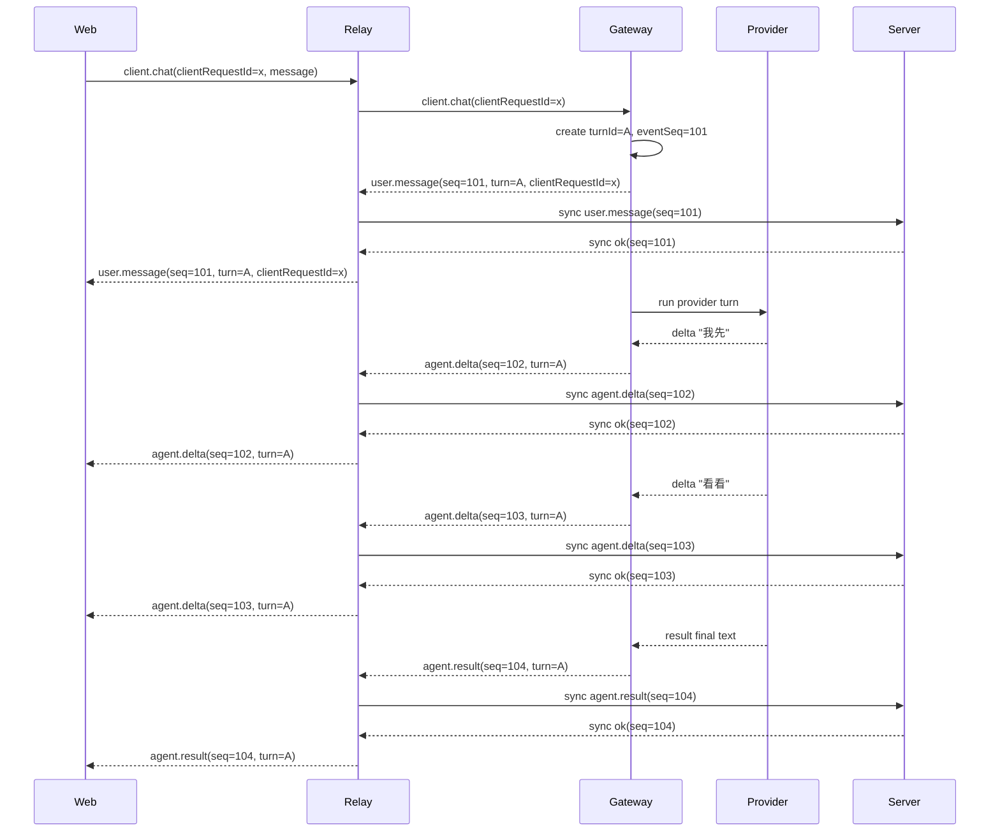
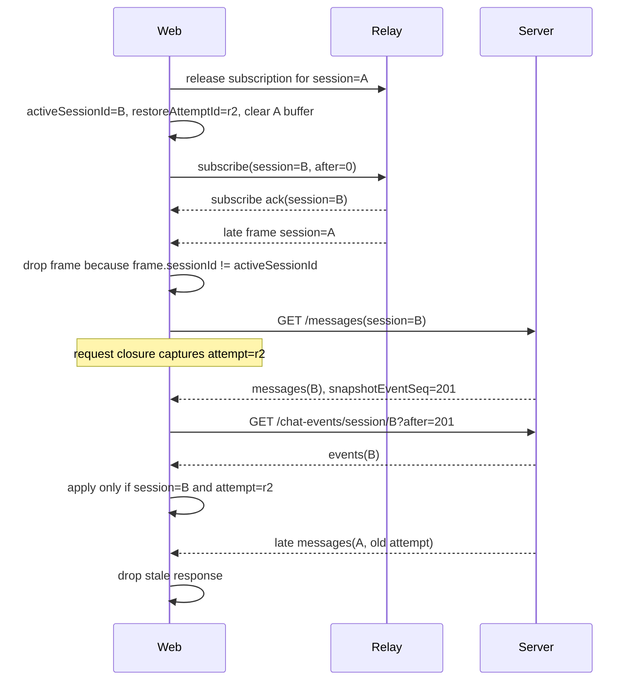
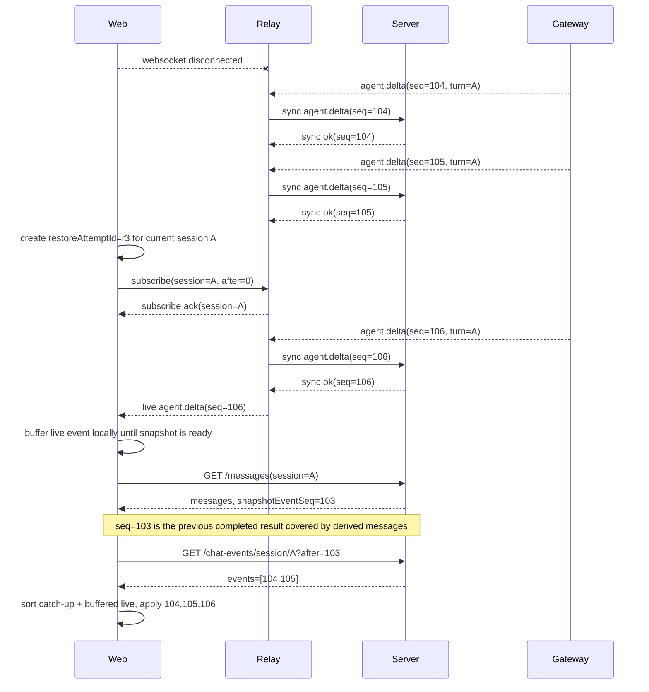
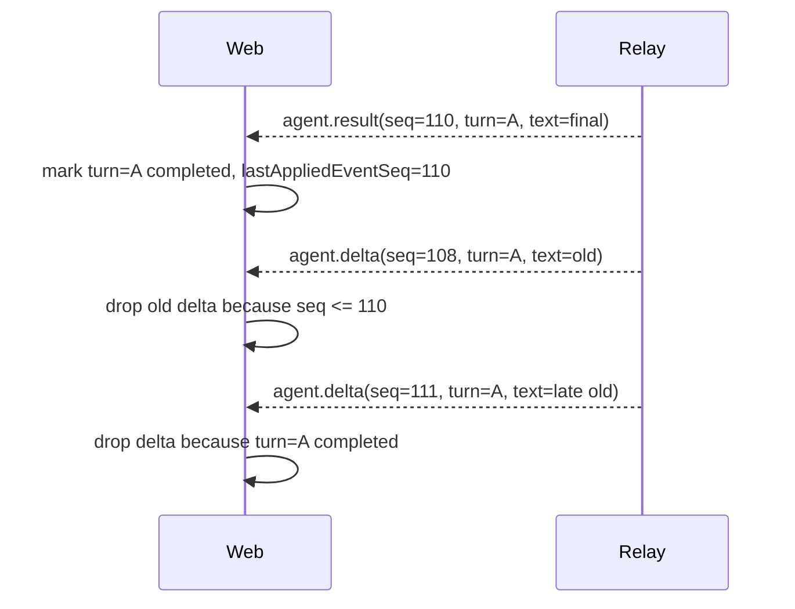
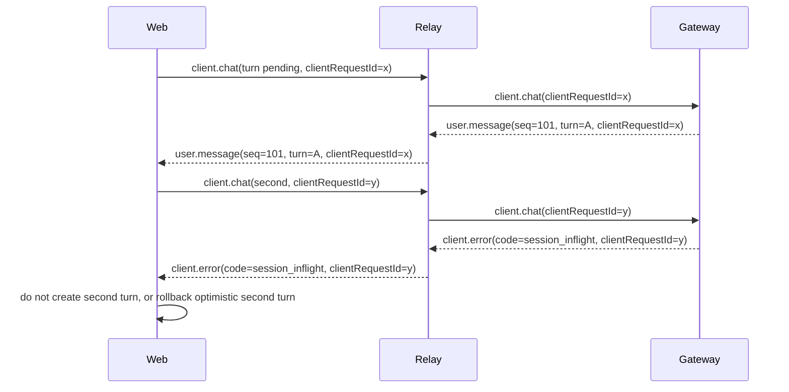

# Chat Event Ordering 与 Web Chat 重构方案

状态：Working

## 背景

当前 `/chats/:sessionId` 会从多个来源合并消息：

- Server history：`/api/server/chat-sessions/:sessionId/messages`
- Relay live frames：`user.message`、`agent.delta`、`agent.result`、`agent.tool`、`session.error`
- Relay reconnect catch-up：`gateway.chat-catchup`

现状里 history 是最终消息表，live/catch-up 是流式事件；两者不是同一条有序事件流。前端只能靠“最后一个 open agent”“文本是否更长”“文本是否重复”“history 是否看起来旧”等启发式规则合并，导致刷新、重连、多轮对话时出现乱序、重复、串轮或 loading 不结束。

本方案把问题收敛成一个契约和一个 Web 落地方案：

- Chat 链路只认结构化事件流：`eventSeq + turnId + clientRequestId + payload`。
- Web 只保留两套核心流程：Create flow 和 Restore flow。
- 刷新、断线重连、左侧切换 session、直接打开旧 URL、登录后回到上次 chat，都复用 Restore flow。
- `chat-panel.tsx` 从“UI + IO + 状态机”拆成可测试模块。

## 当前代码对照确认

本节按 2026-05-14 当前代码确认，不作为目标设计。

| 层 | 当前代码 | 现状 | 对目标方案的影响 |
| --- | --- | --- | --- |
| Web history | `apps/web/src/components/chats/chat-data.ts` | `/messages` 返回 `messages + lastEventId`，没有 `snapshotEventSeq`，history message 没有 `turnId`。 | 刷新后无法可靠知道 snapshot 覆盖到事件流哪里，也无法把历史 assistant 与 live `turnId` 对齐。 |
| Web panel | `apps/web/src/components/chats/chat-panel.tsx` | 同时持有 `currentAgentIdRef`、`lastDeltaEventIdRef`、`messagesRef`、subscription、history load、frame merge 和 loading 收尾。 | UI、IO、时序状态机混在一起，单测只能覆盖工具函数，无法完整锁定场景。 |
| Web catch-up | `chat-panel.tsx` 的 `gateway.chat-catchup` 分支 | 收到 blob 后直接找最新 open agent 或新建 `agent-catchup-*`，并设为 streaming，再补拉 history。 | catch-up 没有 `turnId/result`，容易把已完成会话重新显示成 streaming。 |
| Web delta 去重 | `chat-panel.tsx` 的 `lastDeltaEventIdRef` | 只按 delta `eventId` 去重，并把订阅 `after` 设为 `lastDeltaEventIdRef.current`。 | 因 delta ID 每轮重置，多轮对话和重连会漏 delta 或串轮。 |
| Web result 归位 | `chat-panel.tsx` 的 `agent.result` 分支 | 通过 `currentAgentIdRef`、latest open/lost agent、文本重复和 reveal 逻辑归位。 | result 不能按 turn 归位；同文本、多轮、迟到 result 都依赖启发式。 |
| Web 原型 reducer | `apps/web/src/components/chats/chat-event-reducer.ts` | 已有纯函数草稿，但 `historySnapshotToReducerState()` 没接 `snapshotEventSeq`，`applyChatStreamEvents()` 没排序，`clientRequestId` 未进入类型。 | 可保留为 Wave 0 起点，但不能直接接生产 UI。 |
| Gateway delta ID | `apps/gateway/src/chat/chat-session-runner.ts` | 每个 active subprocess `nextDeltaId: 1`，每轮 delta 从 1 开始。 | 不能作为 session 级 `eventSeq`。 |
| Gateway result ID | `apps/gateway/src/chat/chat-session-runner.ts` / `chat-runtime.ts` | `agent.result` 用 `createChatEvent()` 生成时间型 id，payload 带 `lastDeltaEventId`。 | result 和 delta 不在同一单调序列里。 |
| Gateway catch-up | `apps/gateway/src/relay/relay-sender.ts` | `gateway.chat-catchup` 只发送 `text`。 | 丢失 event/turn/result 结构。 |
| Relay subscribe catch-up | `apps/relay/src/relay.ts` | chat subscribe 时拉 Server `/chat-events?after=`，把 delta raw JSON 拼成 blob 后发 `gateway.chat-catchup`。 | Relay 把结构化事件降级成文本，前端无法正确恢复。 |
| Server chat events | `apps/server/app/service/chatEventsRepository.ts` | 只查 `event_type = 'agent.delta'` 且 `event_id > after`。 | catch-up 无法返回 `user.message/result/error/tool`，也不能按完整事件流恢复。 |
| Server messages waterline | `apps/server/app/service/chatRepository.ts` | `lastEventId` 来自最后一条 assistant result payload 的 `lastDeltaEventId`。 | 这不是 snapshot 的完整事件流水位，只是最后 assistant 的 delta ID。 |

结论：当前实现验证了文档中的方向是必要的。真正要修好时序，不能继续在 `chat-panel.tsx` 里补启发式；要先补事件身份，再把 Web 恢复逻辑收敛到 reducer。

## 全链路修复结论

本问题不能只靠 Web 重构解决。Web reducer 只能消费正确事件；如果 Gateway/Relay/Server 仍然提供每轮重置的 delta ID、blob catch-up、异步落库和非结构化 snapshot，前端仍会在刷新、重连、多轮和左侧切换时漏事件或串轮。

要彻底解决，必须全链路落地：

| 链路 | 必须完成 | 不完成的后果 |
| --- | --- | --- |
| Protocol | `client.chat`、Relay live frame、Server snapshot/catch-up 全部承载 `eventSeq`、`turnId`、`clientRequestId`、`snapshotEventSeq`。 | Web reducer 没有足够信息做 optimistic 合并、turn 隔离和游标去重。 |
| Gateway | 每个 chat session 维护全局单调 `eventSeq`，每轮生成稳定 `turnId`，所有 `user/delta/result/tool/permission/error` 共用同一 sequencer。 | 多轮 delta ID 继续重复，catch-up after 继续失效。 |
| Relay | chat runtime event 采用 `sync-before-broadcast` 或等价一致性策略；subscribe 只做 live 转发，不再发 blob catch-up；subscribe 必须有 ack/registered 语义。 | 快速重连仍可能漏尚未落库事件；Web 同时收到 blob 和 structured catch-up 会重复/串轮。 |
| Server | `/messages` 返回 `snapshotEventSeq` 和可选 `turnId`；`/chat-events?after=` 返回结构化全类型 `events[]`，不是 delta-only。 | 刷新无法知道 snapshot 水位，catch-up 无法恢复 result/error/tool，也无法关闭 loading。 |
| Web | Create/Restore flow 接入 reducer；刷新、重连、左侧切换、旧 URL 统一 Restore；删除旧启发式合并。 | 即使后端事件正确，UI 仍可能被旧请求、旧 frame、文本去重和 current agent 猜测污染。 |

因此本文档的执行目标不是“只做 Wave 0 前端纯函数”，而是全链路修复。Wave 0 可以作为安全起点，但不能作为最终修复交付。

## 已确认问题

### 1. `agent.delta.eventId` 不是 session 内单调递增

Gateway chat runner 当前每轮 turn 都从 `nextDeltaId = 1` 开始发 delta：

```ts
nextDeltaId: 1
deltaEventId = active.nextDeltaId++
```

但 `agent.result` 使用时间型 `nextEventId(ts)`。这会导致同一个 session 中不同 turn 的 delta eventId 重复。

### 2. Server catch-up 只返回 delta

`/api/relay/chat-events/:sessionId?after=...` 当前只查：

```sql
WHERE event_type = 'agent.delta' AND event_id > ?
```

如果前端的 `after` 来自上一轮最后 delta，下一轮 delta 又从 `1` 开始，就会被错误过滤。

### 3. `gateway.chat-catchup` 丢失结构

Relay 当前把多个 delta 拼成一个文本 blob：

```ts
events.map(...).join('')
```

这个 frame 没有 `turnId`、`eventSeq`、`done/result` 语义。前端无法判断它属于哪个 turn，也无法知道是否已经结束。

### 4. History 和 live 语义不同

`gateway_chat_messages` 只派生 `user.message` 和 `agent.result`，不保存 delta 展示态；前端同时消费 history 与 live events，会出现“历史已经完成，但 live catch-up 仍显示 streaming”的冲突。

### 5. Wave 0 reducer 原型仍有契约缺口

当前 `chat-event-reducer.ts` 只能作为目标模型草稿，不能直接接入生产 UI。已知缺口：

| 问题 | 严重度 | 说明 |
| --- | --- | --- |
| `lastEventSeq` 没有用 `snapshotEventSeq` 初始化 | 高 | `historySnapshotToReducerState()` 如果只接收 `messages`，刷新后 reducer 水位仍是 `0`，catch-up 会从头重放历史事件。 |
| 历史 agent ID 与 live `turnId` 无法对齐 | 高 | history 当前只有 `history-agent-0` 这类本地 ID，live event 使用真实 `turnId`；`upsertAgent()` 找不到旧 agent，会导致重复气泡，`completedTurnIds` 也无法阻挡旧 delta。 |
| waiting placeholder ID 依赖测试巧合 | 中 | 原型中 `turn-${historyMessages.length}` 只有在测试 turnId 恰好一致时才能合并，真实 UUID turnId 下会新建第二个 assistant。 |
| `applyChatStreamEvents()` 缺少排序 | 中 | Server/Relay events 无序时必须先按 `eventSeq ASC` 排序；原型如果直接 reduce，会被输入顺序影响。 |
| C6 测试语义要拆成两条 | 中 | 既要测低 `eventSeq` 旧 delta 被游标丢弃，也要测高 `eventSeq` 同 turn late delta 被 completed turn gate 丢弃。 |
| `clientRequestId` 还没进入 reducer 类型 | 低 | E3 optimistic echo 去重依赖 `clientRequestId`，不能靠文本去重。 |

结论：在 Gateway/Server 给 history 和 live event 补齐 `snapshotEventSeq`、`turnId`、`clientRequestId` 前，前端 reducer 只能作为契约测试原型，不能把当前 history 直接强接进去。

Wave 0 测试不能给出“legacy history 已经能和 live turn 正确对齐”的假象。没有 `turnId` 的 history snapshot 只能验证 snapshot 展示和 `snapshotEventSeq` 水位，不能验证 turn-level merge 或 completed-turn gate。

## 目标事件契约

Chat UI 应只围绕一条结构化事件流做合并。每个事件至少具备：

```ts
type ChatEvent = {
  sessionId: string
  eventSeq: number          // session 内严格单调递增
  turnId: string            // 一次 user -> assistant 回合的稳定 ID
  clientRequestId?: string  // Web optimistic user 与 Gateway echo 去重用
  type:
    | 'user.message'
    | 'agent.delta'
    | 'agent.result'
    | 'agent.tool'
    | 'agent.permission_request'
    | 'session.error'
  payload: Record<string, unknown>
  createdAt: number
}
```

约束：

- `eventSeq` 是 session 内全局游标，所有 event 类型共用，不允许每轮重置。
- `turnId` 绑定同一次 user message 与对应 assistant delta/result/tool/error。
- `clientRequestId` 由前端发送消息时生成，Gateway echo `user.message` 时原样带回；前端用它合并 optimistic user，不允许用文本去重。
- `agent.delta` 只增量追加到同一个 `turnId` 的 agent 消息。
- `agent.result` 是该 `turnId` 的最终文本，必须关闭 streaming/waiting。
- `session.error` 必须关闭该 `turnId` 的 waiting/streaming，并标记失败。
- `after` 语义必须是 `eventSeq > after`，不是 delta-only ID。
- catch-up 返回结构化 `events[]`，不要返回拼接 blob。

Server history snapshot 必须返回水位：

```ts
type ChatMessagesSnapshot = {
  messages: Array<{ role: 'user' | 'assistant'; content: string; turnId?: string }>
  snapshotEventSeq: number
}
```

`snapshotEventSeq` 表示 `messages` 已经覆盖到的事件流位置。前端刷新进入时必须用它作为 catch-up 的 `after`，不能再用最后一个 delta ID 猜测。

## Reducer 规则

前端应维护一个纯 reducer，输入 snapshot/live/catch-up 事件，输出稳定消息列表。

### History snapshot

- history 只作为冷启动或重连校准的 snapshot。
- 如果 snapshot 最后一条是 user，则生成一个 waiting agent 占位。
- 如果 snapshot 最后一条是 assistant，则该 assistant 是 completed 状态。
- snapshot 不应该覆盖已经更新的同 turn live delta，除非 snapshot 包含 completed assistant。
- snapshot 必须携带 `snapshotEventSeq`；前端随后订阅或 catch-up 使用 `after=snapshotEventSeq`。
- snapshot 中如果已有 `turnId`，waiting/completed agent 必须绑定该 `turnId`；没有 `turnId` 时只能作为 legacy 兼容，不能作为新协议目标。
- 没有 `turnId` 的 legacy history 不写入 `completedTurnIds`，或者只写入单独的 legacy completed 标记；不能把 `history-agent-*` 这类本地 ID 当成真实 turn gate。

### Live/catch-up events

- 事件按 `eventSeq` 去重：小于等于已应用游标的 event 丢弃。
- Server 或 Relay 返回 events 无序时，前端先按 `eventSeq ASC` 排序再 apply。
- 相同 `turnId` 的 delta/result 合并到同一个 agent item。
- `agent.result` 可以早于旧 delta 到达；result 到达后，同 turn 旧 delta 必须被丢弃。
- 新协议不允许 `eventSeq` 重复；legacy delta ID 重复只能通过 `turnId` 兼容，不能作为目标行为。
- reconnect catch-up 以结构化事件数组重放；重复 event 不新增消息。
- `session.error` 是 turn 终止事件，必须携带 `turnId`；连接断开不是 turn 失败，不能把当前 assistant 直接标 failed。
- `agent.tool`、`agent.permission_request` 属于某个 `turnId`。UI 可以渲染为卡片，但 reducer 必须能把迟到 tool/permission 归位到对应 turn。
- 同 session `eventSeq` 重复是数据错误。前端采用 first-wins，忽略后来的重复 event，并保留诊断入口；不能 last-wins 覆盖时序事实。

## 两套核心流程

Chat 前端只保留两套核心流程：

| 流程 | 适用入口 | 说明 |
| --- | --- | --- |
| Create flow | 新建 chat | 创建新 turn，走 optimistic + live events。 |
| Restore flow | 进入已有 chat | 刷新、断线重连、左侧切换 session、直接打开旧 URL、登录后回到上次 chat 都复用这一套。 |

结论：只要是“进入一个已有 chat session”，都走 Restore flow。不要为刷新、重连、左侧切换分别维护三套恢复逻辑。

### Create flow

```text
1. Web 生成 clientRequestId
2. Web 创建 optimistic user + waiting assistant
3. Web 发送 client.chat(clientRequestId)
4. Gateway 创建 turnId，并 echo user.message(clientRequestId, turnId, eventSeq)
5. Web 用 clientRequestId 合并 optimistic user 和 echo user
6. 后续 delta/result/tool/error 按 turnId 合并
```

当前版本选择简单并发策略：同一 session 同时只允许一个 in-flight turn。

- 如果同一 session 正在 in-flight，Gateway 对第二个 `client.chat` 返回 `session_inflight`。
- 前端收到该错误后不能新增第二个 optimistic turn；如果已经乐观创建，必须回滚或标记失败。
- 不做排队。排队会引入 turn queue、取消、权限等待和错误恢复，复杂度暂不进入本阶段。

### Restore flow

Restore flow 采用“先订阅并 buffer，再加载 snapshot”。这样可以避免 `GET /messages` 与 subscribe 之间无法消除的竞态窗口。

```text
1. Web 准备进入已有 sessionId
2. 如果当前已有旧 session subscription，先 release old subscription
3. 创建 restoreAttemptId，并清空旧 buffer
4. Web 先 subscribe(sessionId, after=0)，并等待 subscribe 已生效
   - buffer 是 Web 本地行为：收到 live events 后先放入本地 buffer，不立即写 UI
   - Relay 不需要知道 buffer，也不负责缓存这段本地初始化窗口
5. GET /messages，得到 messages + snapshotEventSeq
6. Web 用 snapshot 初始化 reducer，lastEventSeq = snapshotEventSeq
7. Web 拉 /chat-events?after=snapshotEventSeq 的结构化 catch-up events[]
8. Web 把 catch-up events 与 buffered live events 一起按 eventSeq 排序后交给 reducer
9. 后续 live events 继续走同一个 reducer
```

兼容流程可以是“先 GET /messages，再 subscribe(after=snapshotEventSeq)”，但这要求 Relay 在 subscribe 时原子地做 catch-up + live 转发，否则仍可能漏掉窗口。实现上优先采用 Web 本地 buffer 流程：Web 拉 snapshot，也由 Web 拉 catch-up；Relay 只负责 live subscribe 转发。

Restore flow 有三个硬约束：

1. `subscribe` 必须有“已注册成功”的语义。Web 不能只把 subscribe frame 发出去就立刻认为 live buffer 已经覆盖窗口；`acquireSessionSubscription()` 要么等待 Relay ack，要么 Relay 必须在处理 subscribe frame 同步注册 client 后再处理同连接后续动作。
2. 目标方案里 Relay subscribe 不再做 blob catch-up。Relay subscribe 只负责 live 转发；结构化 catch-up 由 Web 调 Server `/chat-events?after=snapshotEventSeq` 完成。否则会出现 Relay blob catch-up 和 Web structured catch-up 两套恢复路径并存。
3. Relay 到 Server 的 runtime event sync 必须有一致性策略。不能假设“Relay 已经把断线期间事件写入 Server”一定早于 Web 的 catch-up 请求。

subscribe ack 超时必须有处理路径：

- Web 等待 subscribe ack 超过 5 秒，视为连接/Relay 注册失败。
- 当前 restore attempt 标记 failed，丢弃该 attempt buffer。
- 触发 WebSocket 重连或显示可重试的恢复失败状态。
- 重连成功后重新创建 `restoreAttemptId` 并完整执行 Restore flow。

推荐的一致性策略是 `sync-before-broadcast`：

```text
Gateway event -> Relay
Relay writes Server runtime event successfully
Relay broadcasts live event to Web subscribers
```

这样 Server `/chat-events` 与 Web live event 的顺序源一致，Restore flow 才能保证不漏事件。代价是 live event 多一次 Server 写入延迟，但换来最清晰的恢复语义。

如果后续不采用 `sync-before-broadcast`，必须选择并实现替代方案：

- Relay 维护短期 durable replay buffer，Web catch-up 查 Relay 而不是只查 Server。
- Web 对 in-flight session 做短轮询 catch-up，直到 Server event cursor 追上已知 live 水位或超时。
- 明确记录“快速重连可能漏掉尚未落库事件”的已知限制。这个选项不建议作为目标方案。

### Server/Relay 断线与重启策略

全链路修复必须覆盖服务器临时断线或重启。这里分两类：

| 故障 | 影响 | 目标策略 |
| --- | --- | --- |
| Relay 进程重启 | WebSocket 全断，Relay 内存订阅和内存 buffer 全丢。 | Web 重连后对当前 session 重新执行完整 Restore flow；不能依赖 Relay 内存。 |
| Server API/DB 临时不可用 | Relay 无法 `sync-before-broadcast` 写入 runtime event；Web 也无法拉 snapshot/catch-up。 | Relay 不广播未持久化 chat event，或进入明确 degraded/error 状态；Web 显示连接/恢复失败，不伪造完成态。 |
| Server 写入慢 | Web 已重连但 catch-up 可能早于落库完成。 | `sync-before-broadcast` 保证已广播事件必定已落库；如果采用替代方案，必须有 cursor retry。 |
| Gateway 本机还在跑，Relay 重启 | Gateway 会重新连接 Relay，但 Relay 不应假设可从内存恢复旧事件。 | Gateway/Server 的结构化事件库是恢复来源；Web Restore 从 Server snapshot + catch-up 恢复。 |
| Server 重启但 DB 正常 | 短暂请求失败。 | Web Restore 允许重试 snapshot/catch-up；重试期间显示 recovering，不改写当前消息真相。 |
| Server 重启且 DB 短暂不可用 | snapshot/catch-up 均失败。 | Web 保留已有本地消息，标记恢复失败；用户可重试，不把 waiting 永久保留为“正在思考”。 |

`sync-before-broadcast` 下的故障规则：

- Relay 收到 Gateway chat event 后，必须先写 Server runtime event。
- 如果 Server sync 成功，Relay 才广播给 Web。
- 如果 Server sync 失败，Relay 不能把该事件当作正常 live event 广播；否则 Web 收到后刷新/重连就无法从 Server catch-up 找回。
- sync 失败时 Relay 应返回明确错误或 degraded frame，例如 `relay.sync_failed` / `session.error`，并让 Gateway session 进入可诊断状态。
- 对 delta 事件，不能因为 Server 临时失败就静默丢弃；要么阻塞并重试，要么终止当前 turn 为 failed。第一版建议 fail fast：发 turn-scoped `session.error`，避免 UI 永久 loading。

Web Restore 在服务器故障下的规则：

- WebSocket 断开：不把当前 turn 标 failed，只标连接状态 disconnected。
- WebSocket 恢复：对当前 session 新建 `restoreAttemptId`，完整执行 Restore flow。
- snapshot 请求失败：保留当前 reducer state，显示恢复失败/可重试，不清空消息。
- catch-up 请求失败：不 apply buffered live；继续保持 buffer 到 cap，或终止本次 restore 并显示恢复失败。
- buffer overflow：终止本次增量 restore，重新发起完整 Restore；如果仍失败，显示 diagnostics。
- 所有失败都必须有 UI 可见状态或日志诊断，不能表现为无限 `AI 思考中`。

结论：Relay 不能作为恢复事实源，Relay 内存丢失是正常故障模型。持久事实源必须是 Server runtime events + derived messages；Web 任意刷新、重连、Relay 重启后都只通过 Restore flow 恢复。

Restore flow 的实现载体：

- `restoreAttemptId` 由 `use-chat-session.ts` 在每次 restore 开始时生成。
- `restoreAttemptId` 存在 React ref 中，例如 `currentRestoreAttemptIdRef`，不要用 state 驱动渲染。
- 每个 async 请求闭包捕获本次 `attemptId`，返回后先做 `attemptId === currentRestoreAttemptIdRef.current` 检查，再写 reducer/state。
- live buffer 也按 `attemptId` 隔离；新 attempt 开始时丢弃旧 attempt buffer。
- buffer 到 reducer 的切换必须是单向原子切换。`drainBufferedEvents()` 一旦被调用，buffer 进入 `drained` 状态；此后同一 attempt 的新 live event 不能再进入 buffer，必须直接交给 reducer，或者由 `bufferLiveEvent()` 以 `rejectedEvent` 返回给调用方立即 apply。
- drain 过程必须同步完成：先把 `catch-up events + buffered live events` 排序并一次性交给 reducer，再把 attempt 标记为 live-applying。不能在 drain 中途允许新 live event 绕过排序进入 reducer。
- 第一版 buffer 不做复杂 backpressure。默认 snapshot/catch-up 应在秒级返回；为了避免无限增长，Web 可以设置保守 cap，例如 1000 events 或 1 MB 文本 payload，超出后放弃本次增量 restore，重新触发一次完整 Restore flow 并记录诊断。

左侧切换 session 也是 Restore flow，只是 restore 前必须多做 guard：

```text
activeSessionId = B
restoreAttemptId = new id
release subscription for A
drop buffered events for A
start restore(B, restoreAttemptId)
```

所有异步返回和 live frame 都必须检查：

```ts
if (response.sessionId !== activeSessionId) drop
if (response.restoreAttemptId !== currentRestoreAttemptId) drop
if (frame.sessionId !== activeSessionId) drop
```

只检查 `sessionId` 不够。用户快速点击 `A -> B -> A` 时，第一次 A 的旧请求可能在第二次 A 之后返回；因此需要 `restoreAttemptId` 防止旧请求覆盖新状态。

## 场景确认

### 场景总表

| 场景 | 目标流程 | 目标行为 | 当前实现差距 | 结论 |
| --- | --- | --- | --- | --- |
| 新建 chat | Create flow | Web 生成 `clientRequestId`，创建 optimistic user + waiting assistant；Gateway echo `user.message(clientRequestId, turnId, eventSeq)` 后合并；delta/result 按 `turnId` 更新同一个 assistant。 | 当前 `sendMessage()` 没有为 chat 生成 `clientRequestId`，Gateway chat echo 也没有带回；Web 用本地 `currentAgentIdRef` 归位。 | 目标正确，但依赖 Wave 1/4。 |
| 刷新进入已有 chat | Restore flow | 先 subscribe 并本地 buffer，再拉 `/messages` snapshot，使用 `snapshotEventSeq` 拉 structured catch-up，排序后交给 reducer。 | 当前先 load history，再用 `lastDeltaEventIdRef` 订阅；catch-up 是 blob，history 只有 `lastEventId`。 | 必须改成 Restore flow，是本次 loading 问题主线。 |
| 断线重连 | Restore flow | 重连等同重新进入当前 session：新建 `restoreAttemptId`，重新订阅、拉 snapshot、拉 catch-up、合并 buffered live。 | 当前 reconnect 只是重新 load metadata/history，并依赖 subscription 的 `after=lastDeltaEventIdRef.current`；缺少结构化 catch-up 和 attempt guard。 | 可以完整复用刷新逻辑，不需要单独重连状态机。 |
| 左侧切换 session | Restore flow | release 旧订阅，清空旧 buffer，生成新 `restoreAttemptId`，走同一套 Restore；旧请求和旧 frame 必须被 guard 丢弃。 | 当前有 release subscription 和 `frame.sessionId` 检查，但 history 请求没有 `restoreAttemptId`，`A -> B -> A` 仍可能被旧 A 响应覆盖。 | 也应完整走 Restore flow，并补 attempt guard。 |
| 直接打开旧 URL | Restore flow | 和刷新一致。 | 当前靠 `activeSessionId` effect 加载 history，再订阅。 | 归入 Restore flow。 |
| 登录后回到上次 chat | Restore flow | 和刷新一致，只是 auth ready 后再启动 Restore。 | 当前散落在 auth/session effect 中。 | 归入 Restore flow。 |

### A. 新建 chat

确认后的目标：

1. Web 创建 `clientRequestId`，本地只创建一个 optimistic user 和一个 waiting assistant。
2. Gateway 接受 `client.chat` 后生成 `turnId` 和 session 内递增 `eventSeq`。
3. Gateway echo `user.message` 必须带 `clientRequestId + turnId + eventSeq`。
4. Web 用 `clientRequestId` 把 echo user 合并到 optimistic user，不靠文本去重。
5. `agent.delta`、`agent.result`、`agent.tool`、`session.error` 都绑定同一个 `turnId`。
6. `agent.result` 到达后，该 turn 的 assistant 从 streaming/waiting 变 completed。

当前代码差距：

- `sendMessage()` 对 chat 没有生成 `clientRequestId`。
- `client.chat` frame 当前只发送 `sessionId/message/model` 或新建参数，没有 chat request identity。
- Web 用 `currentAgentIdRef` 绑定本地 pending assistant；这只能处理单页面顺序流，不能处理多端 echo、迟到 result 或同文本消息。

### B. 刷新进入

确认后的目标：

1. 刷新进入已有 `/chats/:sessionId` 一律走 Restore flow。
2. Web 先订阅并把 live frame 放入本地 buffer。
3. Web 拉 `/messages`，得到 `messages + snapshotEventSeq`。
4. reducer 用 snapshot 初始化，`lastEventSeq = snapshotEventSeq`。
5. Web 拉 `/chat-events?after=snapshotEventSeq`，得到结构化 `events[]`。
6. Web 将 catch-up events 和 buffered live events 按 `eventSeq ASC` 排序后 apply。
7. 如果 snapshot 已 completed，旧 delta 必须被 `eventSeq` 或 completed-turn gate 丢弃，不能再出现 loading。

当前代码差距：

- `loadActiveSessionHistory()` 会把 `lastDeltaEventIdRef.current` 先重置为 `0`，再设为 `/messages` 的 `lastEventId`。
- `/messages.lastEventId` 当前来自 `lastDeltaEventId`，不是完整事件流水位。
- subscribe 使用 `after: lastDeltaEventIdRef.current`，但 Gateway delta ID 每轮重置。
- catch-up 到 Web 时已经被 Relay 拼成 blob，无法区分“未完成 delta”还是“已完成旧 delta”。

### C. 断线重连

确认后的目标：

断线重连不单独设计第三套逻辑。它就是对当前 `activeSessionId` 再执行一次 Restore flow：

```text
disconnect -> reconnect -> restore(currentSessionId)
```

这样做的原因：

- 断线期间可能只产生 delta。
- 断线期间可能已经产生 result。
- live result 可能先于 catch-up delta 到达。
- catch-up 与 live 可能重叠。

只有 Restore flow 的 `snapshotEventSeq + structured catch-up + buffered live + reducer` 能同时覆盖这些情况。

当前代码差距：

- reconnect effect 当前只 `loadActiveSessionMetadata()` 和 `loadActiveSessionHistory()`。
- live subscription catch-up 仍走 `after=lastDeltaEventIdRef.current`。
- 没有本地 buffer，也没有把 snapshot/catch-up/live 作为一批排序 apply。

### D. 左侧切换 session

确认后的目标：

左侧切换也不单独设计第三套逻辑。它是：

```text
switch A -> B
release A subscription
drop A buffer
restore(B)
```

必须有两层 guard：

- `sessionId` guard：A 的 live frame 不能写进 B。
- `restoreAttemptId` guard：旧的 B 或旧的 A 请求不能覆盖当前这次 restore。

`restoreAttemptId` 必须存在，因为 `A -> B -> A` 时，两个 A 的 `sessionId` 一样，只靠 `sessionId` 无法判断哪个响应是旧的。

当前代码差距：

- live frame 已有 `frame.sessionId !== currentSessionIdRef.current` 检查，能挡住大部分 A frame 写 B。
- history/metadata 请求没有 attempt guard；旧请求晚返回仍可能 `setMessages()` 或覆盖 metadata。
- subscription release 存在，但没有统一的 Restore flow 生命周期对象。

### E. 多轮对话

确认后的目标：

- 每一轮 user -> assistant 必须有独立 `turnId`。
- `eventSeq` 是 session 全局递增，不允许每轮 delta 从 1 开始。
- 第一轮旧 delta 迟到时，只能归到第一轮或被丢弃，不能接到第二轮 streaming assistant。
- 第二轮 result 只关闭第二轮 assistant。

当前代码差距：

- Gateway delta ID 每轮从 1 开始。
- Web 没有 `turnId`，只能用当前 open agent 猜测。

### F. 错误/中断

确认后的目标：

- provider spawn failed、中途 error、process close 但没有 result，都必须产生 turn-scoped `session.error` 或 synthetic result。
- Web 收到 `session.error(turnId)` 后关闭该 turn 的 waiting/streaming。
- Relay/WebSocket 断开不是 turn error，只触发 Restore flow。

当前代码差距：

- Gateway runner close 时会 `emit.error()`，但 Relay/Web 协议里错误帧不一定带 `turnId`。
- Web 当前 error 分支主要依赖 `currentAgentIdRef` 或当前 inflight 状态，不能稳定关闭指定 turn。

### G. 服务器断线 / 重启

确认后的目标：

- Relay 重启后，WebSocket 会断开，Web 不把当前 turn 直接标 failed；重连后走 Restore flow。
- Relay 重启导致订阅丢失是正常情况，恢复不依赖 Relay 内存。
- Server 临时不可用时，Relay 不能广播未成功持久化的 chat event。
- Server 恢复后，Web 通过 snapshot + structured catch-up 恢复当前 session。
- 如果 Server 长时间不可用，Web 显示 recovering/error，不继续展示无限 thinking。

当前代码差距：

- Relay 当前先广播再 `void syncToServer()`，Server 临时失败时 Web 已收到无法持久恢复的事件。
- Relay subscribe catch-up 依赖 Server，但失败时只是 console warning，Web 没有明确恢复失败状态。
- Web reconnect 当前只重拉 history，没有完整 Restore attempt、buffer、structured catch-up 和失败诊断。

## 时序图

### 1. Create flow：新建 Chat



要点：

- Web 用 `clientRequestId=x` 合并 optimistic user 和 echo user。
- `agent.delta` 追加到 `turnId=A` 的 assistant。
- `agent.result` 替换 `turnId=A` 的最终文本，并关闭 streaming。

### 2. Restore flow：进入已有 Chat，未完成

```mermaid
sequenceDiagram
  participant Web
  participant Relay
  participant Server
  participant Gateway

  Web->>Web: create restoreAttemptId=r1
  Web->>Relay: subscribe(session=A, after=0)
  Relay-->>Web: subscribe ack(session=A)
  Relay-->>Web: live event seq=104
  Web->>Web: guard session=A, attempt=r1; buffer live event locally
  Web->>Server: GET /messages(session=A)
  Server-->>Web: messages=[user], snapshotEventSeq=101
  Web->>Server: GET /chat-events/session/A?after=101
  Server-->>Web: events=[delta seq=102, delta seq=103]
  Web->>Web: reducer init snapshot, then apply sorted catch-up + buffered live
  Gateway-->>Relay: agent.result(seq=105, turn=A)
  Relay->>Server: sync agent.result(seq=105)
  Server-->>Relay: sync ok(seq=105)
  Relay-->>Web: agent.result(seq=105, turn=A)
  Web->>Web: reducer apply result -> completed
```

要点：

- `/messages` 给完成态 snapshot 和 `snapshotEventSeq`。
- Web 拉 `/chat-events?after=snapshotEventSeq` 补未完成流式事件。
- 初始化阶段 live event 先进入 Web 本地 buffer，不能直接写 UI。
- catch-up 和 live 都走同一个 reducer。

### 3. Restore flow：进入已有 Chat，已完成

```mermaid
sequenceDiagram
  participant Web
  participant Relay
  participant Server

  Web->>Web: create restoreAttemptId=r1
  Web->>Relay: subscribe(session=A, after=0)
  Relay-->>Web: subscribe ack(session=A)
  Relay-->>Web: live old delta seq=103
  Web->>Web: guard session=A, attempt=r1; buffer live event locally
  Web->>Server: GET /messages(session=A)
  Server-->>Web: messages=[user, assistant], snapshotEventSeq=105
  Web->>Server: GET /chat-events/session/A?after=105
  Server-->>Web: events=[]
  Web->>Web: init snapshot lastAppliedEventSeq=105
  Web->>Web: drop buffered seq=103 because seq <= 105
  Web->>Web: show completed assistant, no waiting/loading
```

要点：

- snapshot 已覆盖 result，则不创建 waiting。
- 即使旧 delta 在初始化阶段被 buffer 住，因 `eventSeq <= lastAppliedEventSeq` 或 turn completed，应被丢弃。

### 4. Restore flow：左侧切换 Session



要点：

- 左侧切换不需要新流程，本质仍是 Restore flow。
- 切换前必须 release 旧 subscription，并清空旧 buffer。
- 所有异步返回和 live frame 必须过 `sessionId + restoreAttemptId` guard。

### 5. Restore flow：断线重连



要点：

- 断线重连完整复用 Restore flow，不单独维护 last-delta 增量逻辑。
- 重连时重新拉 snapshot 和 catch-up，用 `eventSeq` 重新校准。
- 后续如果性能有压力，再优化成只按 `lastAppliedEventSeq` 增量恢复；第一版先用完整 Restore flow 换稳定性。

### 6. Reducer：Result 先到，旧 Delta 后到



要点：

- `agent.result` 是 turn 终止事件。
- 同 turn result 之后的 delta 不允许污染最终文本。

### 7. Create flow：同 Session 并发发送被拒绝



要点：

- 当前阶段不做排队。
- 同 session in-flight 时第二条消息由 Gateway 明确拒绝。
- 前端不能让第二个 optimistic turn 长期停在 waiting。
- 并发拒绝发生在第二个 turn 创建前，所以使用 `client.error(clientRequestId=y)`，不要使用需要 `turnId` 的 `session.error`。

## Web Chat 重构方案

`apps/web/src/components/chats/chat-panel.tsx` 当前同时承担 UI 渲染、Relay frame 处理、数据加载、新建/刷新/重连/切换流程控制、消息合并和 loading 收尾。重构目标不是重做视觉 UI，而是把它拆成可测试的模块。

目标目录结构固定如下。后续实现时优先按这个结构落文件；如果确实需要改名或合并模块，必须先回到本文档更新契约。

```text
apps/web/src/components/chats/
  chat-panel.tsx
    页面组合、props 连接、渲染入口

  use-chat-session.ts
    Create flow / Restore flow / subscription / fetch / reconnect 编排

  chat-flow-types.ts
    eventSeq / turnId / clientRequestId / snapshotEventSeq / restoreAttempt 类型

  chat-event-reducer.ts
    snapshot + structured events -> MessageItem[] 的纯 reducer

  chat-event-mappers.ts
    Server history / Relay frame / structured catch-up -> reducer 输入

  chat-session-guards.ts
    sessionId / restoreAttemptId / requestId 防旧响应污染

  chat-restore-buffer.ts
    Restore 初始化窗口里的 live event buffer、cap、drain

  chat-restore-plan.ts
    进入 session / 切换 session / 重连时的 restore 步骤计划

  chat-create-flow.ts
    clientRequestId、optimistic user/assistant、echo 合并、发送失败回滚
```

对应测试文件固定如下：

```text
apps/web/test/
  chat-event-reducer.test.ts
  chat-event-mappers.test.ts
  chat-session-guards.test.ts
  chat-restore-buffer.test.ts
  chat-restore-plan.test.ts
  chat-create-flow.test.ts
  use-chat-session.test.ts
```

现有展示组件继续保留，不纳入时序状态机：

```text
apps/web/src/components/chats/
  chat-message-list.tsx
  chat-composer.tsx
  chat-header.tsx
  chat-session-status-popover.tsx
  gateway-selector.tsx
  messages/
    chat-bubble-agent.tsx
    chat-bubble-user.tsx
    permission-prompt.tsx
    tool-card.tsx
    ...
```

目标是“多抽纯函数，多写单测”。不要把所有逻辑都塞进 `use-chat-session.ts`。Hook 只负责编排副作用；能用输入输出描述的逻辑都抽成纯函数。

### 目标函数拆分

`chat-flow-types.ts`：

```ts
export type ChatEventSeq = number;
export type ChatTurnId = string;
export type ChatClientRequestId = string;

export type ChatReducerSnapshot = {
  sessionId: string;
  snapshotEventSeq: number;
  messages: ChatSnapshotMessage[];
};

export type ChatSnapshotMessage = {
  role: 'user' | 'assistant';
  content: string;
  createdAt: string;
  turnId?: ChatTurnId;
  clientRequestId?: ChatClientRequestId;
  usageJson?: Usage;
};

export type ChatStructuredEvent =
  | ChatUserMessageEvent
  | ChatAgentDeltaEvent
  | ChatAgentResultEvent
  | ChatSessionErrorEvent
  | ChatToolEvent
  | ChatPermissionRequestEvent;

export type ChatRestoreAttempt = {
  attemptId: string;
  sessionId: string;
  startedAt: number;
};
```

`chat-event-reducer.ts`：

```ts
export function createInitialChatReducerState(input?: {
  provider?: string;
  now?: number;
}): ChatEventReducerState;

export function stateFromSnapshot(
  snapshot: ChatReducerSnapshot,
  options: { provider: string; legacyMode?: boolean }
): ChatEventReducerState;

export function applyChatEvent(
  state: ChatEventReducerState,
  event: ChatStructuredEvent
): ChatEventReducerState;

export function applyChatEvents(
  state: ChatEventReducerState,
  events: ChatStructuredEvent[]
): ChatEventReducerState;

export function sortChatEventsBySeq(events: ChatStructuredEvent[]): ChatStructuredEvent[];

export function shouldDropEventBySeq(state: ChatEventReducerState, eventSeq: number): boolean;

export function shouldDropEventByCompletedTurn(
  state: ChatEventReducerState,
  event: ChatStructuredEvent
): boolean;

export function upsertUserMessage(
  messages: MessageItem[],
  input: { turnId: string; clientRequestId?: string; content: string; ts: number }
): MessageItem[];

export function upsertAgentMessage(
  messages: MessageItem[],
  input: {
    turnId: string;
    provider: string;
    text: string;
    mode: 'append-delta' | 'replace-result' | 'mark-waiting' | 'mark-failed';
    usage?: Usage;
  }
): MessageItem[];

export function markTurnCompleted(
  state: ChatEventReducerState,
  turnId: string
): ChatEventReducerState;

export function appendTurnScopedSystemMessage(
  messages: MessageItem[],
  input: { eventSeq: number; turnId: string; text: string }
): MessageItem[];
```

`chat-event-mappers.ts`：

```ts
export function mapHistoryResponseToSnapshot(input: {
  sessionId: string;
  response: ChatMessagesResponse;
}): ChatReducerSnapshot;

export function mapRelayFrameToChatEvent(frame: RelayFrame): ChatStructuredEvent | undefined;

export function mapGatewayCatchupFrameLegacy(frame: RelayFrame): LegacyChatCatchup | undefined;

export function mapStructuredCatchupResponse(input: {
  sessionId: string;
  events: unknown[];
}): ChatStructuredEvent[];

export function mapClientErrorToChatFailure(frame: RelayFrame): ChatClientFailure | undefined;

export function parseEventSeq(value: unknown): number | undefined;

export function parseTurnId(value: unknown): string | undefined;

export function parseClientRequestId(value: unknown): string | undefined;
```

`chat-session-guards.ts`：

```ts
export function createRestoreAttempt(sessionId: string, now?: number): ChatRestoreAttempt;

export function shouldApplySessionResult(input: {
  responseSessionId: string | undefined;
  activeSessionId: string | undefined;
}): boolean;

export function shouldApplyRestoreAttempt(input: {
  responseAttemptId: string;
  currentAttemptId: string | undefined;
}): boolean;

export function shouldAcceptLiveFrame(input: {
  frameSessionId: string | undefined;
  activeSessionId: string | undefined;
}): boolean;

export function shouldApplyAsyncRestoreResult(input: {
  responseSessionId: string | undefined;
  activeSessionId: string | undefined;
  responseAttemptId: string;
  currentAttemptId: string | undefined;
}): boolean;

export function shouldReleaseSubscription(input: {
  subscribedSessionId: string | undefined;
  nextSessionId: string | undefined;
}): boolean;

export function shouldStartRestore(input: {
  sessionId: string | undefined;
  authReady: boolean;
  metadataReady?: boolean;
}): boolean;
```

新增 `chat-restore-buffer.ts`，专门让 Restore flow 的本地 buffer 可测试：

```ts
export type ChatRestoreBuffer = {
  attemptId: string;
  sessionId: string;
  events: ChatStructuredEvent[];
  dropped: number;
  overflowed: boolean;
};

export function createRestoreBuffer(input: {
  attemptId: string;
  sessionId: string;
}): ChatRestoreBuffer;

export function bufferLiveEvent(input: {
  buffer: ChatRestoreBuffer;
  event: ChatStructuredEvent;
  maxEvents: number;
  maxPayloadBytes: number;
}): { buffer: ChatRestoreBuffer; rejectedEvent?: ChatStructuredEvent };

export function drainBufferedEvents(input: {
  buffer: ChatRestoreBuffer;
  snapshotEventSeq: number;
  catchupEvents: ChatStructuredEvent[];
}): { buffer: ChatRestoreBuffer; eventsToApply: ChatStructuredEvent[] };

export function isRestoreBufferOverflowed(buffer: ChatRestoreBuffer): boolean;

export function isRestoreBufferDrained(buffer: ChatRestoreBuffer): boolean;
```

新增 `chat-create-flow.ts`，把 optimistic 行为从 hook 里拿出来：

```ts
export function createClientRequestId(now?: number): string;

export function createOptimisticTurn(input: {
  text: string;
  provider: string;
  clientRequestId: string;
  now: number;
}): { user: MessageItem; agent: MessageItem };

// Echo user.message 到达时，必须同时把 optimistic user 和 waiting agent
// 从 clientRequestId 临时身份绑定到真实 turnId。只改 user 会导致后续 delta
// 找不到 waiting agent，并新建第二个 assistant 气泡。
export function reconcileOptimisticTurn(input: {
  messages: MessageItem[];
  clientRequestId: string;
  turnId: string;
  eventSeq: number;
  content: string;
  ts: number;
}): MessageItem[];

export function rollbackOptimisticTurn(input: {
  messages: MessageItem[];
  clientRequestId: string;
  reason: string;
}): MessageItem[];
```

新增 `chat-restore-plan.ts`，让 hook 的副作用编排也能先测计划：

```ts
export type RestoreStep =
  | { type: 'release-subscription'; sessionId: string }
  | { type: 'create-attempt'; attempt: ChatRestoreAttempt }
  | { type: 'subscribe'; sessionId: string; after: number }
  | { type: 'fetch-snapshot'; sessionId: string }
  | { type: 'fetch-catchup'; sessionId: string; after: number };

export function planRestoreStart(input: {
  currentSessionId: string | undefined;
  nextSessionId: string;
  subscribedSessionId: string | undefined;
  now: number;
}): RestoreStep[];

export function planRestoreCatchup(input: {
  sessionId: string;
  snapshotEventSeq: number;
}): RestoreStep;
```

### 模块边界

`chat-panel.tsx` 保留：

- 页面布局
- Header、message list、composer、settings popover、gateway selector 的组合
- 调用 hook 暴露的状态和动作

`chat-panel.tsx` 不再负责：

- 直接合并 delta/result/history
- 直接判断 history 是否过旧
- 持有 `currentAgentIdRef` 这类消息归并状态
- 持有 reconnect catch-up 细节

`use-chat-session.ts` 负责：

- Create flow
- Restore flow
- subscription 生命周期
- snapshot/catch-up 请求编排
- reconnect 时复用 Restore flow

`chat-session-guards.ts` 必须提供独立纯函数：

```ts
shouldApplySessionResult(responseSessionId, activeSessionId)
shouldApplyRestoreAttempt(responseAttemptId, currentAttemptId)
shouldAcceptLiveFrame(frameSessionId, activeSessionId)
```

`chat-event-reducer.ts` 只处理已经确认属于当前 session 的事件，不处理路由、请求生命周期或 subscription。

`chat-event-mappers.ts` 负责把外部输入转成 reducer event：

- Server history snapshot -> reducer snapshot
- Relay `user.message` -> `ChatEvent`
- Relay `agent.delta` -> `ChatEvent`
- Relay `agent.result` -> `ChatEvent`
- Relay `agent.tool` / `agent.permission_request` -> turn-scoped event
- Relay `client.error(session_inflight)` -> create flow rollback

## Legacy 兼容与删除计划

在 Gateway/Server 完成协议升级前，Web 可能仍需要兼容当前字段缺口：

- history 没有 `turnId`
- `/messages` 还没有真正的 `snapshotEventSeq`
- `gateway.chat-catchup` 仍是 blob
- delta event ID 仍可能每轮从 1 开始
- `clientRequestId` 还没有端到端 echo

兼容策略：

- 这些兼容逻辑只能放在 `chat-event-mappers.ts` 或 `use-chat-session.ts`，不要污染 reducer 的目标语义。
- 兼容逻辑必须标注为 legacy，并在 Gateway/Server Wave 完成后删除。
- 不把当前 history 强行接入 reducer 的 turn-level gate；没有 `turnId` 的 history 只能作为 snapshot legacy 展示。

协议和 reducer 接入后，应删除或降级以下逻辑：

- `lastDeltaEventIdRef`
- `historySnapshotLooksOlder()`
- `currentAgentIdRef`
- `findLatestOpenAgentId()` 用于消息合并的路径
- `findLatestLostAgentId()` 用于 result 归位的路径
- 通过文本相同判断重复 result 的逻辑
- 通过文本长度判断 history 是否过旧的逻辑
- `gateway.chat-catchup` blob 直接写 assistant streaming 的逻辑

## 分阶段落地

完整修复必须按全链路顺序推进。Wave 0 只建立前端测试地基；Wave 1-6 才是生产时序修复本体。

### Wave 0：前端契约与纯逻辑测试，不接生产 UI

- 补 `chat-event-reducer.ts` 的契约测试。
- 补 `chat-session-guards.ts` 的 session/attempt guard 测试。
- 补 `chat-event-mappers.ts` 的 mapping 测试。
- 补 `chat-restore-buffer.ts` 的 buffer/cap/drain 测试。
- 补 `chat-create-flow.ts` 的 optimistic/reconcile/rollback 测试。
- 补 `chat-restore-plan.ts` 的 restore step plan 测试。
- `historySnapshotToReducerState()` 必须接收 `snapshotEventSeq`，并用它初始化 `lastEventSeq`。
- `applyChatStreamEvents()` 必须先排序再 apply。
- `clientRequestId` 先进入类型，支持 optimistic echo 去重测试。
- T1 不能继续依赖 `turn-${historyMessages.length}` 与测试 `turnId` 巧合对齐。Wave 0 必须二选一：
  - 推荐：`historySnapshotToReducerState()` 接收可选 `turnId`，测试使用真实 UUID 形态 `turnId`，验证 waiting placeholder 能按真实 turn 合并。
  - 兼容：明确把无 `turnId` 的 waiting 标成 legacy placeholder，测试只验证它能展示 waiting，不验证它能和 live delta 合并；live delta 到达时会创建真实 turn assistant，这是 legacy 限制。
- 对 history completed 的测试必须显式覆盖限制：没有真实 `turnId` 的 completed history 不能依赖 `completedTurnIds` 阻挡旧 delta；只有 snapshot 的 `snapshotEventSeq` 能挡住 `eventSeq <= snapshotEventSeq` 的旧事件。真正的 completed-turn gate 要等 Server history 返回 `turnId`。
- 不修改 `chat-panel.tsx` 的生产数据流。

### Wave 1：Protocol event identity

- `packages/protocol/src/index.ts` 为 chat 事件补齐目标字段。
- `client.chat` 新增 `clientRequestId`。
- Relay -> Web 的 `user.message`、`agent.delta`、`agent.result`、`agent.tool`、`agent.permission_request`、`session.error` 都携带 `eventSeq`、`turnId`，需要时携带 `clientRequestId`。
- Relay subscribe 增加 ack/registered 语义，或明确 `acquireSessionSubscription()` 只有在 Relay 已注册后才 resolve。
- Server `/messages` 响应类型增加 `snapshotEventSeq`，history message 增加可选 `turnId/clientRequestId`。
- Server `/chat-events?after=` 响应类型改为 structured `events[]`。
- 协议测试必须覆盖旧字段兼容和新字段必填边界。

### Wave 2：Gateway event sequencer

- Gateway chat runner 为每个 session 维护单调递增 `eventSeq`。
- 每次 `client.chat` 生成稳定 `turnId`。
- Web 发起 `client.chat` 时带 `clientRequestId`；Gateway 在 echo `user.message` 时带回。
- `user.message`、`agent.delta`、`agent.result`、`agent.tool`、`agent.permission_request`、`session.error` 都携带 `eventSeq` 与 `turnId`。
- `agent.result` 不再通过 `lastDeltaEventId` 表达水位，水位统一使用 session `eventSeq`。
- provider spawn failed、provider error、process close without result 必须发 turn-scoped `session.error` 或 synthetic result，不能只发无 turn 的 gateway error。
- Gateway 对同一 session 并发 turn 返回 `session_inflight`，本阶段不做排队。

### Wave 3：Relay consistency and structured live

- Relay 对 chat runtime event 采用 `sync-before-broadcast`，目标默认：Server sync ok 后再 broadcast Web。
- Relay subscribe 不再生成 `gateway.chat-catchup` blob；旧 blob path 只保留为 legacy 兼容，不进入新 Restore flow。
- Relay live frame 保留 `eventSeq/turnId/clientRequestId`，不能降级成 `eventId/text`。
- Relay 对 subscribe 返回 ack，Web 收到 ack 后才开始 snapshot/catch-up。
- Relay 测试必须覆盖：sync 失败不广播或进入明确错误路径；sync 成功后广播；subscribe ack 后才接收 live。

### Wave 4：Server structured snapshot and catch-up

- `gateway_runtime_chats_events` 记录并查询结构化 chat events。
- `/api/relay/chat-events/:sessionId?after=` 返回 `events[]`，按 `eventSeq ASC`。
- `/api/server/chat-sessions/:sessionId/messages` 返回 `snapshotEventSeq`。
- 保留 `/messages` 作为完成态 snapshot，不再承担 live catch-up 语义。
- `gateway_chat_messages` 派生消息必须保留 source event 的 `turnId`，否则 completed history 无法建立 completed-turn gate。
- `/chat-events` 必须返回 `user.message`、`agent.delta`、`agent.result`、`agent.tool`、`agent.permission_request`、`session.error`，不能 delta-only。
- Server 测试必须覆盖 snapshot 已完成但 catch-up 返回旧 delta、result/error/tool catch-up、无序 events 排序。

### Wave 5：Web 接入 Restore flow 和 reducer

- 刷新进入旧 chat 走 Restore flow。
- 左侧切换 session 走 Restore flow + guard。
- 断线重连复用 Restore flow。
- Restore flow 等 subscribe ack 后开始 snapshot/catch-up。
- Web 本地 buffer 按 `restoreAttemptId` 隔离，超限进入 overflow diagnostics。
- `chat-panel.tsx` 只负责 IO 连接和渲染，把 history/live/catch-up 都交给 reducer。

### Wave 6：Create flow 接入 optimistic 合并并删除旧启发式

- Web 生成 `clientRequestId`。
- optimistic user 使用 `clientRequestId` 作为临时 ID。
- Gateway echo `user.message(clientRequestId, turnId)` 后绑定真实 turn。
- 并发拒绝 `client.error(session_inflight, clientRequestId)` 回滚或标记 optimistic second turn。
- 删除 history/delta/result 的文本猜测逻辑。
- 删除旧 catch-up blob 合并路径。
- `chat-panel.tsx` 收敛为渲染组合组件。

## 单元测试清单

第一批测试要多，且尽量都是纯函数测试。Hook 层只保留少量集成测试；真正的分支复杂度放到 reducer、mapper、guard、buffer、create-flow、restore-plan。

Wave 0 执行要求：

- 下列表格里的测试不是参考项，是 Wave 0 必须补齐的单元测试范围。
- 如果实现时发现某条测试暂时依赖 Wave 1/2 协议字段，必须把它拆成两条：`new-protocol` 目标测试和 `legacy` 限制测试，不能直接删除。
- Wave 0 不接生产 UI，但必须保证纯函数测试能完整复现本文档列出的时序规则。
- 所有新增测试必须进入 `pnpm --filter @tether/web test`。

### `chat-event-reducer.test.ts`

| 编号 | 场景 |
| --- | --- |
| R1 | snapshot 只有 user 且带真实 UUID 形态 `turnId`，生成 waiting assistant，delta 合并到同一 assistant |
| R2 | snapshot 只有 user 但无 `turnId`，生成 legacy waiting；测试只验证展示 waiting，不验证 live turn 合并 |
| R3 | snapshot 已 completed 且带真实 `turnId`，不创建 waiting，不 loading |
| R4 | snapshot 已 completed 且带真实 `turnId`，高 seq 同 turn late delta 被 completed-turn gate 丢弃 |
| R5 | legacy snapshot 已 completed 但无 `turnId`，只能依赖 `snapshotEventSeq` 丢弃旧事件，不能声称 completed-turn gate 生效 |
| R6 | `lastEventSeq` 用 `snapshotEventSeq` 初始化，`eventSeq <= snapshotEventSeq` 的 catch-up 被丢弃 |
| R7 | catch-up 和 live events 重叠，按 `eventSeq` 去重 |
| R8 | `applyChatEvents()` 对无序 events 先排序再 apply |
| R9 | delta 先到，result 后到，result 替换为最终文本并关闭 streaming |
| R10 | result 先到，低 seq 旧 delta 后到，被游标丢弃 |
| R11 | result 先到，高 seq 同 turn late delta 后到，被 completed-turn gate 丢弃 |
| R12 | result 文本比 delta 累计文本更完整，用 result 替换最终文本 |
| R13 | result 文本与 delta 累计一致，不重复插入 assistant |
| R14 | provider 不支持 delta，只返回 result，直接生成 completed assistant |
| R15 | provider error 关闭当前 turn waiting/streaming，并插入 system error |
| R16 | 多轮对话按 `turnId` 隔离，第二轮 delta 不覆盖第一轮 |
| R17 | 第一轮旧 delta 迟到，不能接到第二轮 streaming |
| R18 | 第一轮 result 迟到，只更新第一轮，不影响第二轮 |
| R19 | 多轮 delta `eventSeq` 如果重复，按 first-wins 策略忽略后来的重复事件 |
| R20 | optimistic user 和 echo user 用 `clientRequestId` 合并，不靠文本去重 |
| R21 | 同文本连续发送两次、不同 `clientRequestId`，显示两条 user |
| R22 | `agent.tool` 在 delta 中间到达，归位到当前 turn |
| R23 | `agent.permission_request` 让当前 turn 进入 blocked/waiting 状态，不打断已有 delta |
| R24 | permission deny 后收到 `session.error`，当前 turn failed，不继续 loading |

### `chat-event-mappers.test.ts`

| 编号 | 场景 |
| --- | --- |
| M1 | `/messages` response 映射为 `ChatReducerSnapshot`，保留 `snapshotEventSeq` |
| M2 | history message 带 `turnId/clientRequestId` 时完整透传 |
| M3 | legacy history 无 `turnId` 时标记 legacy，不伪造真实 turn gate |
| M4 | Relay `user.message` 映射 `eventSeq/turnId/clientRequestId/content` |
| M5 | Relay `agent.delta` 映射增量文本和 provider |
| M6 | Relay `agent.result` 映射最终文本、usage、nextSuggestions |
| M7 | Relay `session.error` 映射 turn-scoped failure |
| M8 | Relay `agent.tool` 映射 tool event，保留 input/result/isError |
| M9 | Relay `agent.permission_request` 映射 permission event |
| M10 | 缺 `eventSeq` 的新协议 frame 被拒绝或进入 legacy mapper，不能静默当作 0 |
| M11 | 缺 `turnId` 的 turn-scoped frame 被拒绝或进入 legacy mapper |
| M12 | structured catch-up response 无序，mapper 不负责排序，只返回可排序 events |
| M13 | legacy `gateway.chat-catchup` blob 映射为 `LegacyChatCatchup`，不伪装成完整 structured event |
| M14 | malformed raw event 不抛穿 UI，返回 diagnostic 或 undefined |

### `chat-session-guards.test.ts`

| 编号 | 场景 |
| --- | --- |
| G1 | response sessionId 等于 activeSessionId，允许应用 |
| G2 | response sessionId 不等于 activeSessionId，丢弃 |
| G3 | frame sessionId 等于 activeSessionId，允许应用 |
| G4 | frame sessionId 不等于 activeSessionId，丢弃 |
| G5 | attemptId 等于 currentAttemptId，允许应用 |
| G6 | attemptId 不等于 currentAttemptId，丢弃 |
| G7 | A -> B 切换后，A 的 history late response 被丢弃 |
| G8 | A -> B -> A 快速切换，旧 A attempt response 被丢弃 |
| G9 | subscribedSessionId 与 nextSessionId 不同，需要 release subscription |
| G10 | subscribedSessionId 与 nextSessionId 相同，不重复订阅 |
| G11 | auth 未 ready，不启动 restore |
| G12 | sessionId 为空，不启动 restore |

### `chat-restore-buffer.test.ts`

| 编号 | 场景 |
| --- | --- |
| B1 | create buffer 绑定 `sessionId + attemptId` |
| B2 | live event 进入 open buffer，不立即 apply |
| B3 | drain 时丢弃 `eventSeq <= snapshotEventSeq` 的 buffered event |
| B4 | drain 合并 catch-up + buffered live，并按 `eventSeq ASC` 输出，同时把 buffer 标记为 drained |
| B5 | catch-up 和 buffered live 重叠，输出仍可被 reducer 去重 |
| B6 | 新 attempt 开始时旧 buffer 被丢弃 |
| B7 | buffer 超过 maxEvents 标记 overflowed |
| B8 | buffer 超过 maxPayloadBytes 标记 overflowed |
| B9 | overflowed 后不继续无限累积 events |
| B10 | buffer sessionId 不匹配时拒绝写入 |
| B11 | drained buffer 拒绝继续写入，返回 rejectedEvent 供调用方立即 apply |
| B12 | drain 与 live-apply 切换只允许单向执行，不能重复 drain 同一 buffer |

### `chat-create-flow.test.ts`

| 编号 | 场景 |
| --- | --- |
| C1 | `createClientRequestId()` 生成稳定非空 id |
| C2 | create optimistic turn 生成 user + waiting assistant |
| C3 | optimistic user 带 `clientRequestId`，assistant 也能关联同一个 request |
| C4 | Gateway echo user.message 后按 `clientRequestId` 合并 optimistic user |
| C5 | echo 带真实 `turnId` 后，`reconcileOptimisticTurn()` 同时更新 waiting agent 身份，后续 assistant delta 绑定同一气泡 |
| C6 | 同文本不同 `clientRequestId` 不去重 |
| C7 | `session_inflight` 返回后回滚 optimistic second turn |
| C8 | sendFrame 成功但 Gateway 后续拒绝，waiting assistant 关闭并显示错误 |

### `subscribe ack` / restore failure 集成测试

| 编号 | 场景 |
| --- | --- |
| S1 | subscribe ack 在 5 秒内到达，Restore flow 继续 snapshot/catch-up |
| S2 | subscribe ack 超时，当前 attempt failed，buffer 丢弃，显示可重试恢复失败 |
| S3 | ack 超时后 WebSocket 重连成功，新 attempt 重新执行 Restore flow |

### `chat-restore-plan.test.ts`

| 编号 | 场景 |
| --- | --- |
| P1 | 从无 session 进入 A，计划 create-attempt、subscribe、fetch-snapshot |
| P2 | 从 A 切 B，计划 release A、create-attempt B、subscribe B、fetch-snapshot B |
| P3 | 从 A 重连 A，计划 create-attempt A、subscribe A、fetch-snapshot A |
| P4 | `planRestoreCatchup(snapshotEventSeq=105)` 生成 `fetch-catchup after=105` |
| P5 | 切换 session 时 subscribe 初始 after 固定为 0，后续由 snapshotEventSeq 校准 |
| P6 | 同 session 且已订阅时不重复 release，但 reconnect 可强制新 attempt |

### `use-chat-session` 集成测试

| 编号 | 场景 |
| --- | --- |
| H1 | 刷新进入未完成 chat：subscribe buffer -> snapshot -> catch-up -> reducer |
| H2 | 刷新进入已完成 chat：旧 buffered delta 被丢弃，不 loading |
| H3 | 断线重连复用 Restore flow |
| H4 | 左侧 A -> B 切换，A 的 late history 不覆盖 B |
| H5 | A -> B -> A，第一次 A 的 late response 不覆盖第二次 A |
| H6 | HMR/remount 不重复订阅、不重复 catch-up |

## Wave 0 TODO

Wave 0 目标：只补前端纯逻辑和单测，不接生产 UI，不改 Gateway/Relay/Server 协议。

### Wave 0 新增关键 TODO

| 状态 | TODO | 验收方式 |
| --- | --- | --- |
| [ ] | `reconcileOptimisticTurn()` 必须同时更新 optimistic user 和 waiting agent 的临时身份，把二者绑定到真实 `turnId`。 | C5 单测：echo 到达后，后续 delta 只更新原 waiting assistant，不新增第二个 assistant。 |
| [ ] | `chat-restore-buffer.ts` 必须实现 `open -> drained` 单向状态切换；drain 后同 attempt 的 live event 不再进入 buffer。 | B11/B12 单测：drained buffer 返回 `rejectedEvent`，重复 drain 被拒绝或保持幂等，不乱序。 |
| [ ] | subscribe ack 必须有超时处理，默认 5 秒。超时后当前 attempt failed，buffer 丢弃，进入可重试恢复失败或触发重连。 | S1-S3 单测：ack 成功继续 restore；ack 超时失败；重连后新 attempt 重新 restore。 |
| [ ] | `snapshotEventSeq` 的测试和图示必须明确水位来源：它是 derived messages 已覆盖的最大 session `eventSeq`，通常是上一条已派生 message 的 source eventSeq。 | reducer/server mapper 测试：snapshotEventSeq=103 时，`eventSeq <= 103` 被丢弃，`104+` 进入 catch-up。 |

### Wave 0 文件 TODO

| 状态 | TODO | 文件 |
| --- | --- | --- |
| [ ] | 定义 chat flow 类型：`ChatStructuredEvent`、`ChatReducerSnapshot`、`ChatRestoreAttempt`、`clientRequestId`、`turnId`、`eventSeq` | `apps/web/src/components/chats/chat-flow-types.ts` |
| [ ] | 重写/补齐 reducer：`stateFromSnapshot()` 接收 `snapshotEventSeq`，`applyChatEvents()` 内部排序，legacy history 不伪装真实 completed turn gate | `apps/web/src/components/chats/chat-event-reducer.ts` |
| [ ] | 补 reducer 单测 R1-R24，尤其覆盖 T1 turnId 巧合、completedTurnIds 无效、result 先到、eventSeq 重复、tool/permission/error | `apps/web/test/chat-event-reducer.test.ts` |
| [ ] | 新增 mapper：history response、Relay structured frame、structured catch-up、legacy blob、client error 都转成明确类型 | `apps/web/src/components/chats/chat-event-mappers.ts` |
| [ ] | 补 mapper 单测 M1-M14，缺字段和 malformed payload 必须覆盖 | `apps/web/test/chat-event-mappers.test.ts` |
| [ ] | 新增 guard：sessionId、restoreAttemptId、subscription release、restore start 判断 | `apps/web/src/components/chats/chat-session-guards.ts` |
| [ ] | 补 guard 单测 G1-G12，必须覆盖 A -> B 和 A -> B -> A | `apps/web/test/chat-session-guards.test.ts` |
| [ ] | 新增 restore buffer：buffer live、cap、overflow、drain、按 `snapshotEventSeq` 丢旧事件 | `apps/web/src/components/chats/chat-restore-buffer.ts` |
| [ ] | 补 buffer 单测 B1-B12，必须覆盖 maxEvents/maxPayloadBytes、drained 单向切换、rejectedEvent | `apps/web/test/chat-restore-buffer.test.ts` |
| [ ] | 新增 create flow 纯函数：`clientRequestId`、optimistic turn、echo reconcile turn、rollback | `apps/web/src/components/chats/chat-create-flow.ts` |
| [ ] | 补 create flow 单测 C1-C8，必须覆盖同文本不同 request 不去重、`session_inflight` 回滚、echo 后 waiting agent 绑定真实 turnId | `apps/web/test/chat-create-flow.test.ts` |
| [ ] | 新增 restore plan：进入 session、切换 session、重连时生成可测试步骤 | `apps/web/src/components/chats/chat-restore-plan.ts` |
| [ ] | 补 restore plan 单测 P1-P6，必须覆盖 subscribe 初始 `after=0` 和 snapshot 后 catch-up `after=snapshotEventSeq` | `apps/web/test/chat-restore-plan.test.ts` |
| [ ] | 补 subscribe ack 超时测试 S1-S3，覆盖 5 秒超时、attempt failed、重连后新 attempt | `apps/web/test/use-chat-session.test.ts` |
| [ ] | 如果当前已有 prototype 测试与新契约冲突，改成新契约测试，不保留靠巧合通过的断言 | `apps/web/test/chat-event-reducer.test.ts` |
| [ ] | 运行 Web 单测 | `pnpm --filter @tether/web test` |
| [ ] | 运行 Web typecheck | `pnpm --filter @tether/web typecheck` |

Wave 0 明确不做：

- 不接入 `chat-panel.tsx` 生产数据流。
- 不改 Gateway `eventSeq/turnId` 协议。
- 不改 Relay subscribe/catch-up 行为。
- 不改 Server `/messages` 和 `/chat-events` 返回结构。
- 不删除现有 `historySnapshotLooksOlder()`、`currentAgentIdRef`、`lastDeltaEventIdRef` 等生产路径；这些等 Wave 3/4 再删。

## Wave 0 验收

新增关键问题验收：

- `reconcileOptimisticTurn()` 同时改 optimistic user 和 waiting agent；echo 后后续 delta 不会新建第二个 assistant。
- `createOptimisticTurn()` 生成的 user/agent 临时 ID 能被 `clientRequestId` 稳定查回，供 `reconcileOptimisticTurn()` 替换为真实 `turnId`。
- Restore buffer drain 是单向切换：drain 后 buffer 进入 `drained`，后续 live event 走 immediate apply，不再进入 buffer。
- drain 期间不会让新 live event 绕过排序提前进入 reducer。
- subscribe ack 5 秒超时会终止当前 attempt，丢弃 buffer，并进入可重试恢复失败或触发重连。
- `snapshotEventSeq` 的语义在测试中固定为 derived messages 已覆盖的最大 session `eventSeq`，不是 `lastDeltaEventId`。

代码级验收：

- `apps/web/src/components/chats/chat-panel.tsx` 没有生产行为改动。
- 新增纯逻辑模块均有对应测试文件。
- `stateFromSnapshot()` 必须显式接收 `snapshotEventSeq`。
- `applyChatEvents()` 必须在内部按 `eventSeq ASC` 排序。
- 无 `turnId` 的 legacy history 不写入真实 `completedTurnIds` gate。
- optimistic user 去重只使用 `clientRequestId`，不能使用文本内容。
- restore buffer 有上限策略，超限后进入 overflow 状态，不无限增长。

测试验收：

- `chat-event-reducer.test.ts` 覆盖 R1-R24。
- `chat-event-mappers.test.ts` 覆盖 M1-M14。
- `chat-session-guards.test.ts` 覆盖 G1-G12。
- `chat-restore-buffer.test.ts` 覆盖 B1-B12。
- `chat-create-flow.test.ts` 覆盖 C1-C8。
- `chat-restore-plan.test.ts` 覆盖 P1-P6。
- `use-chat-session.test.ts` 覆盖 S1-S3 和 H1-H6。
- `pnpm --filter @tether/web test` 通过。
- `pnpm --filter @tether/web typecheck` 通过。

行为验收，先通过单测表达，不做人工 UI 验收：

- history 先到、delta 后到，不依赖 `turn-1` 巧合。
- delta 先到、result 后到，result 关闭 streaming。
- result 先到、旧 delta 后到，旧 delta 被游标或 completed-turn gate 丢弃。
- 多轮对话按 `turnId` 隔离。
- reconnect catch-up 与 live 重叠不重复、不串轮。
- 左侧 A -> B -> A 的旧请求不会覆盖新 attempt。
- legacy history 的限制被测试明确表达，不给出虚假信心。

## 全链路 TODO

| 状态 | TODO | 模块 |
| --- | --- | --- |
| [ ] | 更新协议类型：`client.chat.clientRequestId`、chat live frame 的 `eventSeq/turnId/clientRequestId`、subscribe ack、`snapshotEventSeq`、structured catch-up response | `packages/protocol/src/index.ts` |
| [ ] | 补协议测试和类型使用点，确保旧 `eventId` 兼容路径不会被误当作新 `eventSeq` | `packages/protocol`、调用方 |
| [ ] | Gateway 为每个 chat session 建立 event sequencer，所有 chat event 共用 session 单调 `eventSeq` | `apps/gateway/src/chat/*` |
| [ ] | Gateway 为每次 user turn 生成 `turnId`，并贯穿 `user.message/delta/result/tool/permission/error` | `apps/gateway/src/chat/*` |
| [ ] | Gateway 接收并回传 `clientRequestId`，支持 optimistic echo 合并 | `apps/gateway/src/relay/*`、`apps/gateway/src/chat/*` |
| [ ] | Gateway provider error/close without result 产出 turn-scoped `session.error` 或 synthetic result | `apps/gateway/src/chat/chat-session-runner.ts` |
| [ ] | Relay chat event 改为 `sync-before-broadcast`，Server sync ok 后再发 Web live frame | `apps/relay/src/relay.ts` |
| [ ] | Relay 处理 Server sync 失败：不广播未持久化事件，返回明确 degraded/error，避免 Web 收到无法恢复的 live event | `apps/relay/src/relay.ts` |
| [ ] | Relay subscribe 增加 ack/registered 语义 | `apps/relay/src/relay.ts`、`apps/web/src/components/relay/*` |
| [ ] | Relay 新 Restore flow 不再发 `gateway.chat-catchup` blob，legacy path 只供旧 Web 兼容 | `apps/relay/src/relay.ts` |
| [ ] | Server runtime event 查询改成 structured all-events catch-up，不再 delta-only | `apps/server/app/service/chatEventsRepository.ts` |
| [ ] | Server `/messages` 返回 `snapshotEventSeq`，history message 返回可选 `turnId/clientRequestId` | `apps/server/app/service/chatRepository.ts`、controller |
| [ ] | Server 派生 `gateway_chat_messages` 时保留 source event 的 turn 信息，供 completed history 建 gate | `apps/server/app/service/runtimeSyncRepository.ts` |
| [ ] | Web Wave 0 纯函数和完整单测落地 | `apps/web/src/components/chats/*`、`apps/web/test/*` |
| [ ] | Web `use-chat-session.ts` 接入 Restore flow：subscribe ack -> buffer -> snapshot -> structured catch-up -> reducer | `apps/web/src/components/chats/use-chat-session.ts` |
| [ ] | Web 处理 Relay/Server 断线重启：snapshot/catch-up 失败不清空消息，显示 recovering/error，支持重试 | `apps/web/src/components/chats/use-chat-session.ts` |
| [ ] | Web Create flow 接入 `clientRequestId` optimistic 合并 | `apps/web/src/components/chats/chat-create-flow.ts`、`use-chat-session.ts` |
| [ ] | Web 删除旧启发式生产路径：`lastDeltaEventIdRef`、`currentAgentIdRef`、`historySnapshotLooksOlder()`、blob catch-up 写 streaming | `apps/web/src/components/chats/chat-panel.tsx` |
| [ ] | 更新 Relay/Gateway/Server/Web 测试，覆盖刷新、重连、左侧切换、多轮、error、tool/permission | 全链路 |
| [ ] | 人工 UAT：复测已知问题 session、新建运行中刷新、已完成刷新、断线重连、A -> B -> A 快速切换 | Web + Relay + Gateway + Server |

## 全链路验收

全链路修复完成必须同时满足以下条件：

- Protocol 层不再把 chat event 只表达为 `eventId/text`；新路径必须有 `eventSeq/turnId/clientRequestId`。
- Gateway 同一 session 内所有 chat event 的 `eventSeq` 严格单调递增，不因 turn 重置。
- Gateway 每个 user turn 有稳定 `turnId`，result/error/tool/permission 都能归位。
- Relay chat live event 采用 `sync-before-broadcast` 或等价一致性策略；快速重连不会漏尚未落库事件。
- Server sync 失败时 Relay 不广播未持久化 chat event，并产出明确错误/诊断。
- Relay 新 Restore flow 不再发送 `gateway.chat-catchup` blob。
- Server `/chat-events?after=` 返回结构化全类型 events，并按 `eventSeq ASC`。
- Server `/messages` 返回真实 `snapshotEventSeq`，不是 `lastDeltaEventId`。
- Web 刷新、断线重连、左侧切换、直接打开旧 URL、登录恢复都走同一套 Restore flow。
- Web Restore flow 等 subscribe ack 后再 snapshot/catch-up。
- Web 在 Relay 重启、Server 临时不可用、catch-up 失败时不会清空消息或永久 loading；必须显示 recovering/error 并允许重试。
- Web reducer 能处理 result 先到、旧 delta 后到，多轮 delta ID 重复，同文本多次发送，tool/permission 迟到。
- Web 不再依赖文本长度、文本重复、latest open agent、blob catch-up 来决定消息真相。
- 所有自动化验证通过：
  - `pnpm --filter @tether/web test`
  - `pnpm --filter @tether/web typecheck`
  - Gateway chat/event 相关测试
  - Relay chat subscribe/broadcast/sync 相关测试
  - Server runtime sync/chat-events/messages 相关测试
  - Protocol typecheck/test

## 业务行为验收

- 新建 chat 不重复显示 user。
- 新建 chat 的 assistant 从 waiting -> streaming -> completed 状态稳定切换。
- 刷新运行中的 chat 能恢复 streaming，不丢 delta。
- 刷新已完成 chat 不显示 `AI 思考中`。
- 断线重连与刷新走同一套 Restore flow，不维护单独补丁逻辑。
- 左侧切换 session 不会被旧请求或旧 live frame 污染。
- 多轮对话中第二轮 delta 不会因为 `after` 大于 delta ID 被漏掉。
- result 先到、旧 delta 后到时，最终文本不被旧 delta 追加污染。
- 断线重连 catch-up 不会把上一轮内容接到下一轮 agent 气泡里。
- 同文本连续发送两次不会被误去重。
- optimistic echo 不靠文本去重，必须按 `clientRequestId` 合并。
- Provider error 或 spawn error 必须结束当前 turn，不允许永久 loading。
- 代码层面 `chat-panel.tsx` 不再直接持有消息合并状态机。
